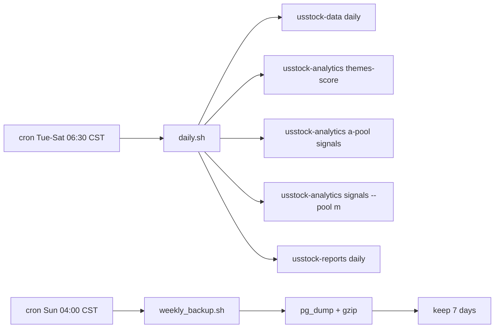

# Deployment Runbook

## Overview



`deploy/daily.sh` is intentionally boring: five serial commands, one log file, and
`set -euo pipefail`. If any layer fails, the whole run fails and cron can mail the
failure. Logs are written to `${HOME}/logs/daily-YYYY-MM-DD.log`.

## Atomic Cutover

Run on LightOS only after local review has passed.

```bash
ssh -p 2222 naivedog@<host>
cd ~/us-stock-research

# 1. Back up current production state.
~/scripts/weekly_backup.sh

# 2. Pull the reviewed trunk.
git pull
uv sync

# 3. Run idempotent schema migration.
uv run python -m usstock_data.schema.migrate

# 4. Initialize universe state.
uv run python -m usstock_data.universe sync
uv run python -m usstock_data.universe list --pool a

# 5. Backfill the planned 2026-04-29 gap.
uv run python -m usstock_data daily --as-of 2026-04-29
uv run python -m usstock_analytics themes-score --date 2026-04-29
uv run python -m usstock_analytics a-pool signals --date 2026-04-29
uv run python -m usstock_analytics signals --date 2026-04-29 --pool m
uv run python -m usstock_reports daily --date 2026-04-29 --no-discord

# 6. Replace scripts atomically enough for this personal project.
cp deploy/daily.sh ~/scripts/daily.sh
cp deploy/weekly_backup.sh ~/scripts/weekly_backup.sh
chmod +x ~/scripts/daily.sh ~/scripts/weekly_backup.sh

# 7. Let the next scheduled cron run naturally.
```

`--no-discord` is used for the 2026-04-29 cutover backfill because the webhook
secret should be rotated before production push notifications are re-enabled.

## Rollback

Migrations are ADD-only, so rolling back code does not drop production data.

```bash
git revert HEAD
git push origin master

ssh -p 2222 naivedog@<host>
cd ~/us-stock-research
git pull

cp deploy/daily.sh ~/scripts/daily.sh
cp deploy/weekly_backup.sh ~/scripts/weekly_backup.sh
chmod +x ~/scripts/daily.sh ~/scripts/weekly_backup.sh
```

If multiple commits need rollback, revert the reviewed range explicitly and keep
the DB in place. The next good deploy can continue from the same database.

## Troubleshooting

| Symptom | Check | Response |
| --- | --- | --- |
| cron did not run | `crontab -l` and `tail ~/logs/daily-*.log` | Run `~/scripts/daily.sh YYYY-MM-DD` manually and query `alert_log` |
| `spy_ret` KeyError | indicator rows far below active universe count | Fixed in V5 data layer; inspect the compute-indicators fix commit if it reappears |
| A-pool signals empty | `config/a_pool.yaml` has `status: active`; `usstock-data universe sync` passed | Re-run universe sync and then `usstock-analytics a-pool signals --date YYYY-MM-DD` |
| Discord does not send | `DISCORD_WEBHOOK_URL`; `alert_log` where `job_name='reports.discord'` | Rotate/reset the webhook URL and rerun reports |
| Notion write fails | `NOTION_TOKEN`; `NOTION_DAILY_DB_ID`; integration database permissions | Reconnect the Notion integration and rerun reports |
| atexit PermissionError（Win 本地 pytest 噪音） | exit code 是否为 0 | exit code 是 0 就忽略，跟踪到 V5+1，不阻塞生产 |

## Cron

先跑 `timedatectl` 确认系统时区。

UTC 系统时区版本：

```cron
30 22 * * 1-5 /home/naivedog/scripts/daily.sh
0  20 * * 6   /home/naivedog/scripts/weekly_backup.sh
```

Asia/Shanghai 系统时区版本：

```cron
30 6 * * 2-6 /home/naivedog/scripts/daily.sh
0  4 * * 0   /home/naivedog/scripts/weekly_backup.sh
```

The daily cron processes the previous UTC day, which corresponds to the prior US
trading session for this workflow.

## Environment

Required for daily operation:

- `DATABASE_URL`
- `FMP_API_KEY`
- `POLYGON_API_KEY`
- `FRED_API_KEY`
- `NOTION_TOKEN`
- `NOTION_DAILY_DB_ID`
- `DISCORD_WEBHOOK_URL`
- `GOOGLE_APPLICATION_CREDENTIALS`

`GOOGLE_APPLICATION_CREDENTIALS` is for Vertex AI verdict generation. If the LLM
call fails or times out, the A-pool verdict code writes a fallback verdict and an
`alert_log` warning instead of blocking the whole daily run.

## Local Checks

```bash
bash -n deploy/daily.sh
bash -n deploy/weekly_backup.sh
shellcheck deploy/daily.sh deploy/weekly_backup.sh
```

`shellcheck` is recommended when available; it is not required by CI.
