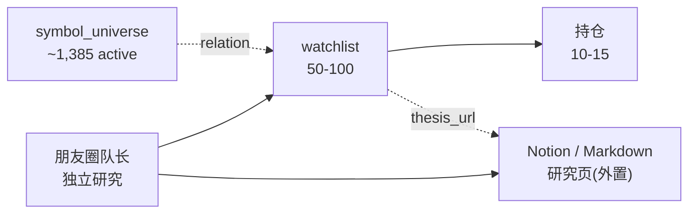
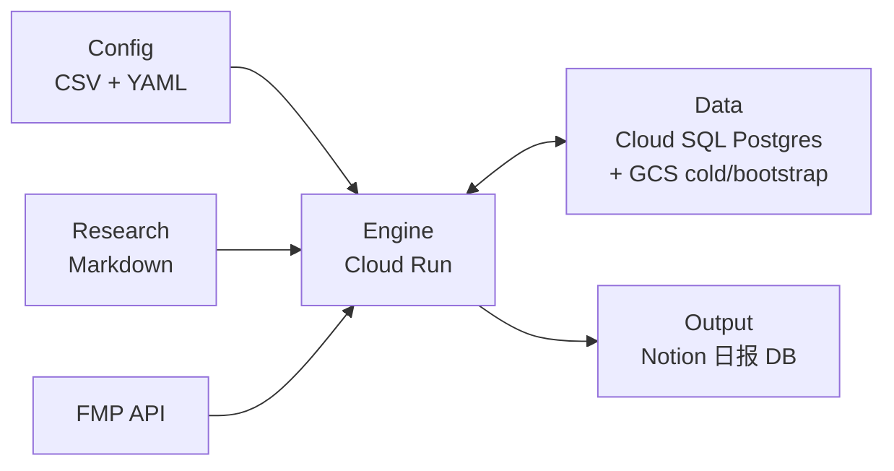

# 架构决策记录 ADR

<aside>
📚

**Architecture Decision Records（ADR）** — 记录所有关键设计决策的前因后果、方案对比、作废选项。时间倒序，最新在上。未来讨论时优先查本页以理解"为什么是现在这个样子"。

</aside>

## ADR-033 · 云端 ETL + 本地 BI 分层 · 模拟盘从日报剥离 (2026-04-29)

**决策**:云端 Cloud Run Job 职责收敛为"信号生产 + 数据归档" — 每天计算 L1-L4 + 宏观信号写 Cloud SQL 5 张 signals 表 · 日报只展示信号(不含 NAV / 双池仓位 / 触发链事件)。**模拟盘从云端日报剥离** · 改本地 CLI 工具(`python -m simulator.backtest`)用户按需触发跑 7 触发链回测调参。**Hermes 分析层接 Cloud SQL** · MCP 只读直连(P3.19)· 用户对话查询板块 / 个股 / 主题数据。

**背景**:M3-S1 PR2+PR3-B 落地后(`b1b891b`)用户提出三个观察:① 每日 NAV 信息量低(波动噪音 · 周/月聚合才有意义) · ② 模拟盘 7 触发链 + 双池 NAV + 上日报是 M3-S2 整块 · 拖长 MVP 落地 3-4 天 · ③ Cloud SQL 已有所有信号数据 · Hermes 能直读做按需分析(MCP 半天活)。本 ADR 把云端职责收敛到 ETL + 归档 · 决策 / 调参 / 分析全部下沉本地 · 业界经典 ETL + Analytics 分层。

### 新分工

| 层 | 部署位置 | 职责 | 触发频率 |
| --- | --- | --- | --- |
| **数据生产(ETL)** | Cloud Run Job + Cloud SQL | 跑 L1-L4 + Macro 信号引擎 · UPSERT 5 张 signals 表 + alerts | 北京早 06:00 自动 |
| **日报输出** | Cloud Run Job → Notion / Discord | 读 signals 表 · 渲染日报 | 与 ETL 同 Job |
| **回测调参(模拟盘)** | 本地 Python CLI | 7 触发链 + 双池 NAV + 滚动绩效 · 输出 `bt_reports/<run_id>.csv` | 用户按需 |
| **分析层(Hermes)** | 本地 MCP server + cloud-sql-proxy | Hermes 查 Cloud SQL · 板块 / 个股 / 主题人话分析 | 用户按需 |

### 日报内容裁剪

- **保留**:Header(指数 + 档位)· 宏观定调 · L1 档位 · L2 宽度告警 · L3 11 SPDR · L4 ETF Top 3 · 个股 Top 5 · 风险提示
- **删除**:§8 模拟交易追踪整段(NAV / 仓位 / 流水 / 累计战绩)· row properties 中 `NAV_ETF_Pool` / `NAV_Stock_Pool` 字段

### 关键设计决策

**1. 模拟盘代码不删 · 移本地 CLI**:7 触发链(ADR-019)+ 三段加仓(50/30/20)+ trade_id 幂等(ADR-018)+ 档位防抖(ADR-020)逻辑全部保留 · 入口改 `python -m simulator.backtest --from YYYY-MM-DD --to YYYY-MM-DD` · 读 Cloud SQL signals 表生成模拟交易 · 写本地 SQLite `backtest.db`。

**2. ADR-018 / ADR-019 降级 · 仅本地回测用**:trade_id 幂等 + 7 触发链优先级仍然要保证正确性 · 但调度位置从云端每日 → 本地按需 · 代码无需重写。

**3. ADR-020 不变**:档位防抖冷却是 L1 dial 模块一部分 · 信号引擎仍每日云端跑。

**4. ADR-021 简化**:Notion 双层持久化策略不变 · row properties + page body 内容删 NAV 段。

**5. Hermes MCP 接入路径**:见 P3.19 · 4 步本地配置(Cloud SQL `hermes_reader` 只读 role + postgres-mcp-server + cloud-sql-proxy + Claude Desktop / Codex MCP 配置)· 半天活 · 等 PR3 push master + 真数据落地后做。

### MVP 加速

| 项 | 原计划 | ADR-033 后 |
| --- | --- | --- |
| MVP 范围 | M3-S1 + M3-S2 + M3-S3 | M3-S1 + M3-S3(简化) |
| 估时 | 4-7 天 / 4-6 PR | 2-4 天 / 2-3 PR |
| 关键路径 | PR3 → S2(2-3 PR)→ S3 | PR3 → S3(简化) |

### 权衡

- **方案 A**(采用):云端 ETL · 本地 BI · 模拟盘做工具
- 方案 B:全部留云端 · 模拟盘每日跑 · NAV 上日报 — 工程范围大 · 信息冗余 · MVP 拖长
- 方案 C:模拟盘云端 + NAV 不上日报 — 拆分点不自然
- 方案 D:模拟盘双轨(云端 + 本地)— 维护成本高 · 不必要

### 采用理由

业界经典 ETL + Analytics 分层(Cloud Lakehouse + 本地 BI 客户端);个人投资节奏下每日 NAV 边际信息量低 · 周/月聚合按需跑更有意义;Hermes 接 Cloud SQL 解锁的分析能力远大于"日报展示 NAV";MVP 缩到一半时间落地。

### 影响

- M3-S1 PR3 任务书**不变**:macro + orchestrate + Cloud Run Job 还是要做
- M3-S2 **降级**:从云端调度产物 → 本地 CLI 调参工具 · 排 MVP 之后
- M3-S3 **简化**:日报模板删模拟追踪段 · row properties 删 NAV 字段 · 任务书更轻量
- ADR-018(trade_id 幂等)= 仅本地回测使用
- ADR-019(7 触发链优先级)= 仅本地回测使用
- ADR-020(档位防抖)= 不变 · L1 dial 继续每日跑
- ADR-021(Notion 双层持久化)= 简化 · NAV 段删除
- [模拟交易追踪系统](https://www.notion.so/7ab8a36758d54ec687e7d1e757d41308?pvs=21) 重新定位 · 从云端每日 → 本地 CLI + Hermes 按需查询
- [日报输出格式](https://www.notion.so/658060c74741479390e5629ae988e7ac?pvs=21) 删 §8 模拟追踪 · row properties 删 NAV 字段
- [🗂️ 升级 & 待办备忘录](https://www.notion.so/513a3eed74a54c3fab033df6b314e937?pvs=21) P3.19 Hermes MCP 是本 ADR 的延伸落地

### 预留升级路径

- **若实战需要每日 NAV**:本地 CLI 加 `--push-to-notion` flag · 用户按需触发推送 · 不污染主流水
- **A 池信号上线后**(PR-A3):同样写 Cloud SQL · Hermes 一并能查
- **实盘桥接 M4**:从模拟盘 CLI 分出 · 独立部署 · 跟本 ADR 并存
- **Hermes 写权限**:强烈不推荐 · 守 ADR-024 + ADR-027 单向流动 · 任何写入必须经 PR

---

## ADR-032 · M 池信号引擎实施(L1-L4 + Macro · 5 子模块 · 拆 3 段 PR)(2026-04-29)

<aside>
📊

**双轨命名**:本 ADR 仅覆盖**短线池(M 池 / m_pool)** · 长线池(A 池)信号引擎走 PR-A2(校准)+ PR-A3(信号)独立 PR 链(详见 ADR-030)。

</aside>

**决策**:在 PR1(6 表 DDL ✅)+ PR2(daily_indicators 装载层 ✅)之上 · 新建 **M 池信号引擎** · 拆为 5 个子模块(L1 regime / L2 breadth / L3 sectors / L4 themes+stocks / Macro)· 输出写入 PR1 已建的 4 张 M 池信号表(`signals_daily` / `signals_stock_daily` / `signals_alerts` / `signals_macro`)· 拆 **PR3-A / PR3-B / PR3-C** 三段交付 · 每段独立完整可 merge。

**背景**:PR1 信号表骨架已建 · PR2 daily_indicators 装载层已铺好(30 字段两池共用)· 现在到了让信号"流"起来的时候。M 池信号规则在 [核心逻辑](https://www.notion.so/b0234e466f1e407996a938c1e3d5a24a?pvs=21) §1-§9 已详细定义(ADR-001/003/004/010/015/016/020/028 系列锁定)· 本 ADR 不重新讨论规则 · 只锁实施分工 + 接口契约 + 触发链对接。

### 5 子模块清单

| 模块 | 输入 | 输出表 | 关键 ADR | PR 段 |
| --- | --- | --- | --- | --- |
| **L1 Regime** | macro_daily(VIX/SPY) · daily_indicators(SPY 宽度) | signals_daily.regime + .regime_streak | ADR-004/015/020 | PR3-A |
| **L2 Breadth** | daily_indicators(全 universe) · sp500 成员 | signals_alerts(5 类告警) + signals_daily.breadth_* | ADR-008/009 | PR3-A |
| **L3 Sectors** | daily_indicators(11 SPDR) | signals_daily.sectors_top3 + sectors_quadrant | ADR-016 | PR3-B |
| **L4 Themes + Stocks** | themes.yaml + daily_indicators + L3 板块加成 | signals_daily.themes_top3 + signals_stock_daily | ADR-001/028 | PR3-B |
| **Macro** | macro_daily + BTC | signals_macro(8 场景 + BTC) | ADR-003/010 | PR3-C |

### 关键设计决策

**1. 单 Job 全 5 模块顺序跑**(不拆 5 个独立 Job):L1→L2→L3→L4→Macro 依赖链清晰 · 单 Job 内实现为 5 个函数顺序调 · 交付名 `signals-daily-job` · 已在 ADR-031 触发链中占位 05:30 UTC · task_timeout=20min · 重试 3 次。

**2. SELECT 严守 ADR-017 信号池隔离**:信号引擎 ONLY SELECT `quotes_daily` / `daily_indicators` / `macro_daily` / `etf_holdings_*` / `themes_yaml` · NEVER SELECT `positions_current` / `trades_log` / `stage_entries` / `nav_daily`(simulator 专属)。CI grep 4 条断言继续生效。

**3. as_of_date 强制约束**:所有 `FROM daily_indicators` 必带 `WHERE trade_date <= :as_of_date`(防 backtest 偾看未来)。backtest mode 只换参数重跑。

**4. UPSERT 幂等**:每张信号表 PK = (as_of_date, symbol) 或 (as_of_date)· 重跑零污染(ADR-018)。

**5. verdict_text 规则化**:M 池信号是纪律性档位 · 规则 if-else 即可 · 不接 LLM。LLM 润色仅 A 池用(ADR-030)· M 池 V5 再考虑。

### 数据契约

**signals_daily**(单行/日):regime · regime_streak · breadth_50ma_pct · breadth_200ma_pct · breadth_nh_nl · breadth_mcclellan · sectors_top3(JSON)· themes_top3(JSON)· alert_count · macro_scenario · macro_btc_status

**signals_stock_daily**(每股每日):symbol · as_of_date · technical_score · sector_bonus · theme_bonus · final_score · rank · regime · entry_signal(B1-B5)· exit_signal(S1-S3)· warning_signal(W1-W2)

### 实施拆段(重点)

- **PR3-A**(L1 + L2 · 基础信号层)· 估 Codex 1 工作日 · 8-10 文件
- **PR3-B**(L3 + L4 · 排名打分层)· 估 1 工作日 · 10-12 文件
- **PR3-C**(Macro · 收尾 + Job 装配)· 估 半工作日 · 5-6 文件

每段独立完整可 merge · 不阻塞下游。所有三段合并后·跳口在 `scripts/run_signals.py --modules L1,L2,L3,L4,macro` · --modules 缺省 = all。

### 验收要点

- 单元测试每模块 ≥ 5 个 case(boundary 条件 · 避免起跑期样本不足 ⚠)
- 集成测试 · 1 年 fixture · 验 signals_daily 365 行 · signals_stock_daily ~400k 行
- 回测 mode 跑 2025-01-01 ~ today · 抽 5 个交易日人工对比 daily_indicators + signals 自洽

### 权衡

- **方案 A**(采用):PR3 拆 3 段(A/B/C)· 每段独立可 merge · 部分下游可并行启动
- 方案 B:PR3 一次 5 模块全交付 · 单 PR 文件 25+ · review 重 · Codex 一次活质量风险
- 方案 C:拆 5 个 PR 按模块 · 太碎 · review 5 次累 · 接口反复改
- 方案 D:每模块独立 Cloud Run Job · 资源浪费 · 依赖链拆裂

### 采用理由

L1 · L2 是基础(其他模块不依赖)· 先出能独立 merge 上线;L3 · L4 是排名打分层 · daily_indicators 主要者;Macro 完全独立 · 收尾即可。每段 PR 范围可控 · Codex 一次活质量高。

### 影响

- [核心逻辑](https://www.notion.so/b0234e466f1e407996a938c1e3d5a24a?pvs=21) §1-§9 实施层全部落地 · §17 新增 V4.0.13
- [Cloud Run 部署方案](https://www.notion.so/Cloud-Run-a6b3fc28e5f341789442133653585c0d?pvs=21) 仓库结构 `signals/` 子目录正式启用
- [参数中心](https://www.notion.so/28c61e309a6644ffaaa01519f133a47a?pvs=21) §1-§11 参数被信号引擎读取 · SoT 锁在 `config/params.yaml`
- ADR-017 4 条 CI 断言扩展到 signals 模块 grep 校验
- 上游依赖:PR1(6 表 ✅)+ PR2(daily_indicators ✅)
- 下游依赖:PR-A3(A 池信号 · 独立)+ PR4(publisher 日报输出)

### 预留升级路径

- **信号细化**:L4 个股加 momentum / quality / value 三因子加权
- **多周期**:加 weekly_signals 表 · 周末跑 · 月度趋势辅助
- **实时信号**:V5 加 intraday_signals · 5min 粒度
- **HK 股扩展**:同 schema · 加 market 字段
- **A/B 测试**:`run_id` 字段支持参数扫描(ADR-018 预留)

---

## ADR-031 · 技术指标装载层 · daily_indicators 表 + compute-indicators-daily Job (2026-04-29)

<aside>
📊

**双轨命名**：本 ADR 产出的 `daily_indicators` 表 · **两池共用**(短线池 M · 长线池 A 信号引擎均读这张表)·属于 M2 数据流水线 · 表本身不分池。

</aside>

**决策**：在 M3-S1 PR1(6 表 DDL 已合)之后·新建 **`daily_indicators`** 表(约 30 个技术指标字段 · v1 一次到位 · 含 SMA/EMA/MACD/布林带/RSI/OBV/ATR/ADX/52W 距离/β 等)+ 独立 Cloud Run Job **`compute-indicators-daily`** · 夹在 `quotes-etl-job` 与 `signals-daily-job` 之间 · pandas 计算 · 历史回填 1 年。

**背景**：PR1 只建了信号表骨架 · 信号引擎要读的技术指标还没装载层。若在信号计算时才现算 · 两池重复计算 + 历史回测难复现。關联列为中间表·治三招：防重复 · 防看未来 · 保留资产可检索。

### 字段清单(30 字段 · v1 一次到位)

```sql
CREATE TABLE daily_indicators (
  symbol               VARCHAR NOT NULL,
  trade_date           DATE    NOT NULL,
  -- 移动均线
  sma_5                NUMERIC, sma_10  NUMERIC, sma_20  NUMERIC,
  sma_50               NUMERIC, sma_200 NUMERIC,
  ema_12               NUMERIC, ema_26  NUMERIC,
  -- MACD
  macd_line            NUMERIC, macd_signal NUMERIC, macd_histogram NUMERIC,
  -- 布林带(20, 2)
  bb_upper             NUMERIC, bb_middle NUMERIC, bb_lower NUMERIC, bb_width NUMERIC,
  -- 动量
  rsi_14               NUMERIC,
  -- 成交量
  obv                  BIGINT,  vwap_20 NUMERIC,
  -- 波动率
  atr_14               NUMERIC, std_20 NUMERIC, std_60 NUMERIC,
  -- 趋势强度
  adx_14               NUMERIC, di_plus_14 NUMERIC, di_minus_14 NUMERIC,
  -- 位置
  pct_to_52w_high      NUMERIC, pct_to_52w_low NUMERIC, pct_to_200ma NUMERIC,
  -- 相对
  beta_60d             NUMERIC,  -- vs SPY
  -- 趋势斜率
  ma200_slope_20d      NUMERIC,  -- 200MA 近 20 日斜率(%) · A 池趋势健康系数用
  computed_at          TIMESTAMPTZ NOT NULL DEFAULT now(),
  PRIMARY KEY (symbol, trade_date)
);
CREATE INDEX idx_daily_indicators_date ON daily_indicators(trade_date);
CREATE INDEX idx_daily_indicators_symbol ON daily_indicators(symbol);
```

### 计算选型 · pandas + numpy(不依赖 ta-lib)

- pandas rolling 实现 SMA/EMA/std/RSI/MACD · 零依赖问题
- ATR/ADX 需 high/low/close · 已在 `quotes_daily` 存
- OBV = cumsum(sign(close 变化) × volume) · 一行 pandas
- β = cov(个股 60d 收益率, SPY 60d 收益率) / var(SPY) · 考虑 SPY 作为 benchmark
- 拒绝 ta-lib(C 依赖 · GCP 镜像编译费事)

### 幅度与性能

- 每日增量：约 1100 个 symbol × 检点当日 · 本地 × 5 分钟可跳
- 历史回填：1 年 × 1100 symbol · ~280k 行 · db-f1-micro 可在 30 分钟内进完
- pandas vectorize 处理 · 按 symbol 分组 + chunk 提交 UPSERT

### 调度 · 独立 Cloud Run Job + 触发链

- **新 Job**: `compute-indicators-daily`
- **触发链**：美股收盘后 · Cloud Scheduler 按顺序调 · 或 Pub/Sub 事件拼接：
    
    ```
    quotes-etl-job (拉价) 
      → compute-indicators-daily (本 ADR 新建) 
      → signals-daily-job (M + A 两池信号) 
      → publisher-daily (日报)
    ```
    
- **幂等**：UPSERT(symbol, trade_date)· 重跑零污染(ADR-018)
- **失败重试**：Cloud Run Job native retry × 3 · alert_log 记录代码 + symbol

### M2 数据流水线隶属

`daily_indicators` 位于 M2 Curation 层与 M3 Operate 层之间 · ADR-026 三阶段架构中 · 实际调度在云端 · 但表本身是主算法与 A 池信号引擎的公共输入层 · 不属于任一池。

### 与 ADR-017 隔离原则的关系

- `daily_indicators` 是**只读表**(类似 `quotes_daily`)· 算法中立 · 不入 ADR-017 三段表清单的"只写"列表
- M 信号引擎 + A 信号引擎 均可 SELECT · 但仅 `compute-indicators-daily` Job 可 WRITE
- 可加一条 CI 断言：`FROM daily_indicators` 同查询必带 `trade_date <= :as_of_date`(防 backtest 偏看未来)

### 权衡

- **方案 A**(采用)：独立 表 + 独立 Job + 30 字段 v1 一次到位
- 方案 B：字段明文存 `quotes_daily` 加列 → 表肿胀 + 变更代价高
- 方案 C：信号引擎现算 → M/A 重复算两次 + 历史回测不可重现
- 方案 D：ETL Job 里差话算几个 → 指标体系脱错 · 不可扩展

### 采用理由

中间层合理拆分 · M/A 共享零漂移 · 一次计算 N 次读取 · 1 年历史与后期报表可随时 SQL 检查·v1 一次到位避免多次 ALTER 表 · v2 加字段零成本(只加列 + 历史 NULL)。

### 实施 PR

- **PR2**(本 ADR 产物 · Codex)：migration 003 建表 + `scripts/compute_indicators.py` + Cloud Run Job + Scheduler 接入触发链 + 1 年回填

### 影响

- [核心逻辑](https://www.notion.so/b0234e466f1e407996a938c1e3d5a24a?pvs=21) §14 数据表清单补 `daily_indicators` · §17 新增 V4.0.12
- [Cloud Run 部署方案](https://www.notion.so/Cloud-Run-a6b3fc28e5f341789442133653585c0d?pvs=21) 拓扑加 `compute-indicators-daily` 节点 + 触发链调整
- [参数中心](https://www.notion.so/28c61e309a6644ffaaa01519f133a47a?pvs=21) 预留 §13 技术指标计算参数(示例：β 窗口 60d · RSI 窗口 14 · ADX 窗口 14 · 均使用业界默认)
- ADR-017 CI 断言加一条：`FROM daily_indicators` 带 `trade_date <= :as_of_date`(P1)
- 上游依赖：`quotes_daily` 必须先写完 · 下游：`signals_daily` / `signals_a_pool_daily` 依赖本表

### 预留升级路径

- **v2 加字段**：Ichimoku / Stochastic / Williams %R / VWAP 多窗口 / Donchian · 只加列 · 历史 NULL
- **多周期**：加 `weekly_indicators` / `monthly_indicators` 表 · 同样独立 Job
- **HK 股扩展**：表 schema 不变 · symbol 加 `.HK` 后缀 · benchmark 改 [2800.HK](http://2800.HK)
- **实时指标**：若 V5 需要 5min 级·加 `intraday_indicators` 独立表

---

## ADR-030 · A 池长线 thesis 技术择时系统(信号系统 · 平行旁路) (2026-04-28)

<aside>
🌳

**双轨命名 · 2026-04-28**："A 池" = UI 展示的**长线池(Long Pool)** · 后端代号 `a_pool` 不变 · 数据表 `signals_a_pool_daily` / `a_pool_calibration` 不改。"M 池" = UI 展示的**短线池(Short Pool)** · 后端代号 `m_pool`。历史 ADR 中的 "M 池 / A 池" 表述保留不改 · 后续新文档 UI 面向优先用双轨名。

</aside>

**决策**:在 M3 主算法之外新建 **A 池技术择时引擎** · 对 watchlist 中 thesis_status='active' 的长线票每日跑 11 类技术信号 + 三维评分(弹性/性价比/盈亏比) · 输出**信号 + 三层入场点 + 两层止损 + 短期目标 + 一句话判断**。**系统只给信号 · 不管仓位 · 不管 M/A 搭配**(仓位由用户自行决定)。每个票的支撑位 / 止损位 / RSI 阈值由 **per-symbol 历史画像**(5Y 数据 · 周一凌晨刷新)校准 · 共用 M2 数据流水线但信号链与 M 物理隔离。

**背景**:M 池为纯技术动量短线波段 · 无法处理"长期 thesis 锁定 + 短中期技术择时"的核心-卫星策略。ADR-029 watchlist 旁路表已就绪但只承载 thesis 元数据 · 缺技术信号驱动层。直接合并到 M3 信号引擎会污染算法纯净性(selection bias)+ 打乱档位仓位映射;完全独立又重复造数据流水线。本 ADR 锁定**平行旁路**架构。

### 系统职责边界

**做**:对每个 active thesis 票每日跑 11 类信号(5 入场 + 4 出场 + 2 警示)· 每票每日打三维分(弹性 35% + 性价比 30% + R:R 35%)· 输出三层入场点(激进 / 保守 / 极保守)+ 两层止损(浅 / 深)+ 短期目标 · 输出 verdict_text(规则骨架 + LLM 润色)· 周更 per-symbol 历史画像。

**不做**:不算仓位 · 不算预算占比 · 不强制状态机交易 · 不进 M3 模拟盘 NAV(M/A 战绩对比走未来 A-S4)· 不给 thesis 评分(thesis 真伪由队长 / 用户 / Hermes 维护)。

### 关键设计决策

**1. Per-symbol 历史画像(核心创新)**:每票挖 5Y 数据出"性格"——典型洗盘 -X%(中位)/ 深度 -X%(90 分位)/ 极端 -X%(95 分位)/ 强支撑 3-5 个(K-means 聚类历史反弹点)/ 个性化 RSI 5%/95% 分位 / 典型上涨段长度 + 幅度 / β 稳定性。固化在 `a_pool_calibration` 表 · 周一凌晨增量刷新(`calibrate-a-pool-job`)· 信号引擎读这张表用个性化阈值打分。理由:NVDA 的 RSI 超卖位可能是 36 · KO 可能是 31 · 统一阈值不准。

**2. 信号阈值放宽 + 多候选 + 强制说明字段**:v1 严格 7 信号 → v3 宽容 11 信号(5 入场 + 4 出场 + 2 警示)· 每个信号必须附 **explanation**(人话解释)+ **hist_ref**(历史对照:这个形态过去 N 次出现 · 30D 后平均涨跌 X%)。理由:用户偏好"信号覆盖广 + 给说明" · 由人最终决策。

**3. 历史对照算法约束**:`hist_ref` 必须**多区间回测**(3Y / 5Y / 10Y 三档分别给数 · 后续胜率算 30D 平均涨跌而非赢率)。理由:单一时间窗易过拟合 · 多区间一致才说服力强。

**4. 战略 vs 战术 R:R 双层**:战略 R:R = (target_price - close) / (close - thesis_stop) · 仅作过滤(<2 禁加仓)· 不参与打分;战术 R:R = (next_resistance - close) / (close - tactical_stop) · 真正打分指标。理由:thesis 目标可能是 3-5 年视角 · 跟当下技术 stop 时间维度错配 · 直接除会让 R:R 严重高估。

**5. 性价比加趋势健康系数(防抓底死)**:价值原始分 × 趋势健康系数(基于 200MA 20D 斜率 · 0.50-1.00)。理由:便宜不等于值得买 · 长期趋势向下时再便宜也是接刀。

**6. 三维评分硬过滤 + 软过滤**:F1 流动性(20D 均成交额 ≥ $10M)· F2 价格连续性(近 5 日无 ±15% 跳空 · 防财报黑天鹅)· F3 三维一致性(任一 <50 → A_Score -10)。

**7. verdict_text = 规则骨架 + LLM 润色**:规则 if-else 决定 `action_hint`(`wait_pullback` / `enter_now` / `scale_in` / `trim` / `exit`)· LLM 润色为 1-2 句人话 · 输入画像 + 信号 + 价位结构(~500 token)· 输出 ~50 token。成本预估 12 票 × 252 交易日 × 单次 <$0.0001 ≈ **$0.3/年**(可忽略)。理由:纯规则呆板 · 纯 LLM 不可控 · 混合方案兼顾可控 + 自然。

**8. LLM 接入方案 = Vertex AI Gemini 2.0 Flash(GCP 原生)**:同 GCP 项目 Service Account 授权 · `google-cloud-aiplatform` SDK · 无跨云成本 · 走 GCP 统一账单。

```python
from vertexai.generative_models import GenerativeModel
import vertexai
vertexai.init(project='naive-usstock-live', location='us-central1')
model = GenerativeModel('gemini-2.0-flash')
verdict = model.generate_content(prompt).text
```

### 数据架构

- **新表 1**:`a_pool_calibration` · 画像 · 每票一行 · 周更新
- **新表 2**:`signals_a_pool_daily` · 日信号 · 每日每票一行 · UPSERT 幂等(ADR-018)
- 字段 schema 详见 [核心逻辑](https://www.notion.so/b0234e466f1e407996a938c1e3d5a24a?pvs=21) §A

### M/A 物理隔离

共用 M2 数据流水线(`quotes_daily` / `etf_holdings_latest` / `macro_daily`)· M 信号写 `signals_daily` / `signals_stock_daily` · A 信号写 `signals_a_pool_daily`(完全独立表)· M 主算法 SELECT 不访问 a_pool 表 · A 引擎 SELECT 不写 M 表 · 日报输出层共用(M3-S3)但 Notion 板块物理分开。

### 调度

- **calibrate-a-pool-job** · Cloud Run Job · Scheduler `0 17 * * 0`(北京周一凌晨 1 点)· 周更画像
- **A 池信号引擎**挂在 `signals-daily-job` S1 阶段(每个美股交易日早 6 点北京时间 · 复用 orchestrate)

### 实施 PR

- **PR-A1** · DDL · `a_pool_calibration` + `signals_a_pool_daily` 建表 · **与 M3-S1 PR1 一起提交**(单 PR 一次到位 · 避免后改表)
- **PR-A2** · 历史回测校准引擎 · 上行段识别 + 洗盘提取 + K-means 强支撑 + 个性化 RSI 分位 + `calibrate-a-pool-job`
- **PR-A3** · 每日 A 池信号引擎 · 11 类信号 + 三维评分 + 三层入场两层止损 + verdict 生成(规则 + Vertex AI Gemini)
- **PR-A4** · 日报 A 池板块 · Notion 个股看板 + Discord 简版

### 权衡

- **方案 A**(采用 · 平行旁路):共享 M2 数据 · 信号链物理隔离 · 输出层共用
- 方案 B(完全独立子系统):重做数据流水线 · 资源浪费
- 方案 C(合并到 M3 加 pool 字段):污染算法纯净性 · selection bias · 档位映射打乱
- 方案 D(不做 A 池):watchlist 仅人工跟踪 · 失去技术择时 alpha

### 采用理由

核心-卫星策略落地需要技术择时补充(thesis 在但不知何时上车);**Per-symbol 校准是关键**:不同票"性格"差异大 · 统一阈值会让 NVDA 和 KO 用同一套规则必然失真;**只给信号不管仓位**对齐用户偏好(M/A 怎么搭配是用户哲学问题不是系统问题);**LLM 润色 verdict 性价比极高**($0.3/年换可读性大幅提升)。

### 影响

- [核心逻辑](https://www.notion.so/b0234e466f1e407996a938c1e3d5a24a?pvs=21) 新增 §A · A 池长线 thesis 技术择时系统;§17 新增 V4.0.11
- [参数中心](https://www.notion.so/28c61e309a6644ffaaa01519f133a47a?pvs=21) 新增 §12 A 池技术择时
- [Cloud Run 部署方案](https://www.notion.so/Cloud-Run-a6b3fc28e5f341789442133653585c0d?pvs=21) 仓库结构新增 `scripts/calibrate_a_pool.py` + Cloud Run Job `calibrate-a-pool-job` + Scheduler 周一 cron
- M3-S1 PR1 DDL 同步加 `a_pool_calibration` + `signals_a_pool_daily` 两表
- ADR-029 watchlist 表 status 字段语义补充:`thesis_ready` / `held` 状态 = `signals_a_pool_daily` 引擎工作目标
- M3-S3 日报新增 A 池板块(每票个股看板格式)

### 预留升级路径

- **A-S4 队长制**:Hermes 复核 thesis · 评审会节奏 · 战绩对比 M 池 → 决定是否引入更多队长
- **画像融合 LLM**:洗盘识别加 LLM 自然语言注解
- **多市场扩展**:HK 股 thesis 票走同一套引擎 · 仅切数据源
- **实盘对接**:M4 实盘后 · A 池信号可同样接富途 / Alpaca · 但仓位决策仍由用户拍

---

## ADR-029 · 朋友圈协作架构:watchlist 旁路表 + 主表零侵入 (2026-04-27)

**决策**:朋友圈协作的"特别关注池"采用**旁路表方案**(选项 D)——`symbol_universe` 主表保持纯净不加 `track_code` 字段;新建独立 `watchlist` 表(待 M3 朋友圈上线时落库)承载所有跟踪元数据;研究内容外置不进 DB,DB 只存"事实 + 决策锚"。M2-S1 schema 不受朋友圈协作影响。

**背景**:朋友圈协作架构([投资认知 · Alpha/Beta 框架与核心目标](https://www.notion.so/Alpha-Beta-74eb49563df240b0963534e213282a29?pvs=21) Watchlist 三层架构中的中间层 50-100)需要数据层支撑,但触发了 schema 设计决策——"队长跟踪信息"放主表(track_code 字段)还是独立表? M2-S1 `curate_universe.py` 即将定型 `symbol_universe` schema,这个决策必须在 M2 起步前做掉,否则要么 M2 期间硬编码字段,要么 M3 ALTER TABLE。投资认知页 Watchlist 三层架构(Universe 1,385 → Watchlist 50-100 → 持仓 10-15)的中间层在数据层缺位。

### watchlist 表 schema(M3 朋友圈上线时落库)

```sql
CREATE TABLE watchlist (
  symbol               VARCHAR PRIMARY KEY REFERENCES symbol_universe(symbol),
  source               VARCHAR NOT NULL,            -- 队长名 / 'self' / 朋友昵称
  added_date           DATE    NOT NULL,
  sector               VARCHAR,                     -- 主赛道(1:1 暂定 · 见预留)
  target_market_cap    NUMERIC,                     -- USD · 估值锚
  status               VARCHAR NOT NULL,            -- watching|researching|thesis_ready|held|exited|rejected
  thesis_url           VARCHAR,                     -- 可空 · Notion / Markdown URL
  updated_at           TIMESTAMPTZ NOT NULL DEFAULT now()
);
CREATE INDEX idx_watchlist_status ON watchlist(status);
CREATE INDEX idx_watchlist_sector ON watchlist(sector);
```

**关键设计**:

- **目标只存市值不存价格**:目标价由代码反算 `target_price = target_market_cap / shares_outstanding`(quotes_daily 现成数据),避免股本变化(回购/增发/拆股)导致目标价定型失真
- **status 必须有**:Watchlist 必须支持出表语义(`exited` / `rejected`),否则只增不减一年后变垃圾堆
- **thesis_url 可空但建议填**:一个 URL 字段是研究产出的反向追溯入口,成本极低
- **研究内容外置**:`thesis_url` 指向的 Notion 页/Markdown 文件是 thesis 真源,DB 不存研究文本
- **symbol 为 PK**:一个 symbol 在 watchlist 只能一行 · 出表后重新加 = update status + added_date(不建新行)

### 数据流



- Universe → Watchlist:队长从 Universe 选标的进 Watchlist(本地 PR · ADR-024 合规)
- Watchlist → 持仓:决策入场后 status 改 `held`(与 trades_log 联动)
- Watchlist → 研究页:thesis_url 字段链回研究产出

### 权衡

- **方案 A**:`symbol_universe` 加 track_code 字段(VARCHAR · nullable)— 字段语义早期定型风险高 · M2 期间死字段 · 改字段名比 ALTER 加列更痛
- **方案 B**:不加 · M3 ALTER `symbol_universe` 加列 — schema 定型晚字段更准,但所有跟踪元数据挤进主表导致字段膨胀
- **方案 C**:`symbol_universe.metadata` JSONB 字段 — 违反 ADR-027 Postgres 强类型理念 · 类型检查丢失 · 索引/查询效率差 · 同源偏差温床
- **方案 D**(采用):旁路 `watchlist` 表 + relation — 主表纯净 · 朋友圈 schema 独立演进 · 1:N 赛道扩展可走 · JOIN 成本极低(都是小表)

### 采用理由

- **关注分离**:Universe(系统纪律层 · 1,385)与 Watchlist(进攻预备役层 · 50-100)概念上是不同语义的池,不应该挤一张表
- **schema 演进自由**:朋友圈是实验性架构(队长制 / 评审会 / 投资合伙协议都还没实战),独立表后期改 schema 不动主表
- **回滚成本低**:朋友圈架构若不成功,删一张表零影响;主表加列后撤销要 migration
- **与原 P3.16 Watchlist DB 同构**:本表实际就是 P3.16,统一思路减少认知负担
- **JOIN 成本极低**:`symbol_universe`(1,385) JOIN `watchlist`(50-100)都是小表,索引 PK 关联毫秒级
- **目标市值字段编码投资哲学**:"被低估的好基本面" → schema 上明文存"我对这只股票的市值预期",反推折价率即估值锚,直接服务 P3.17 估值便宜提醒

### 不在本 ADR 范围(留待后续 ADR / 朋友圈实战后凝练)

- **赛道字段粒度**:1:1(主赛道)还是 1:N(NVDA = AI-chip + datacenter)— 取决于朋友圈实战是否常见跨赛道,1-2 月后定
- **来源类型升级**:VARCHAR(队长名)→ relation 到 `researchers` 表 — 队长 ≥ 5 时必要,否则 over-engineering
- **投资合伙协议**:进出仓决策权 · 队长权利与义务 · 评审会节奏 — 朋友圈实战后凝练
- **评审会 SOP**:节奏 / 输入 / 产出 / 决策机制 — 同上
- **Hermes 队长复核改造**:Hermes 在 watchlist 上的二次定性 / 量化复核 — 待 Watchlist 数据有规模(20+ 标的)后启用

### 影响

- [US Stock Research](https://www.notion.so/US-Stock-Research-02ba1059d4c6463c97872df5cf5329db?pvs=21) Watchlist 三层架构落数据层(中间层补齐)
- [投资认知 · Alpha/Beta 框架与核心目标](https://www.notion.so/Alpha-Beta-74eb49563df240b0963534e213282a29?pvs=21) Watchlist 三层架构挂 ADR-029 链接
- M2-S1 `curate_universe.py` 任务书:`symbol_universe` schema **不加** track_code · 朋友圈相关字段全部归 watchlist 表(M3 才建)
- [Cloud Run 部署方案](https://www.notion.so/Cloud-Run-a6b3fc28e5f341789442133653585c0d?pvs=21) M3 阶段新增 `db/migrations/<datestamp>_create_watchlist.sql`
- [🗂️ 升级 & 待办备忘录](https://www.notion.so/513a3eed74a54c3fab033df6b314e937?pvs=21) P3.13(track_code)废止 · P3.16(Watchlist DB)纳入本 ADR · P3.17 估值便宜提醒由本 ADR target_market_cap 字段支撑
- ADR-024 单向流补充:`watchlist` 表写入由用户/队长本地 PR(类比 etf_universe.csv 流程)· Cloud Run 只读 watchlist 不写

### 预留升级路径

- **赛道 1:N**:实战发现跨赛道常见 → `sector` VARCHAR 改 `sector_primary` + 新建 `watchlist_sectors` join 表(1:N)· migration 影响小
- **来源 relation 化**:队长 ≥ 5 时,`source` 改 `researcher_id`(FK to `researchers`)· 加 `researchers` 表(name / role / joined_at)
- **目标市值历史轨迹**:若需追踪 thesis 演进,新建 `watchlist_targets_history`(symbol, set_at, target_market_cap, set_by, reason)· 不动 watchlist 主表
- **多 thesis URL**:`thesis_url` VARCHAR → `thesis_urls` array(若一个 symbol 多人研究多产出)
- **持仓挂接**:status `held` 时从 `positions_current` 反查 watchlist 行(symbol JOIN),不需要冗余存
- **Watchlist DB Notion 镜像**:Cloud Run 单向同步 watchlist → Notion DB(类比 ADR-025 参数中心镜像模式)给朋友圈队长 UI

---

## ADR-028 · themes.yaml 种子策略:ETF 反推 + 人工 review 混合 (2026-04-24)

**决策**:V4 启动期 themes.yaml 采用 **C 混合路径** — Codex `scripts/generate_themes_from_etf.py` 从 ETF 审核池 `algo_role=L3_theme` 行反推主题 → 按 Theme 聚合 ETF → 读 holdings → 按权重累加 + 多 ETF 交集切核心 / 扩散 → 输出 YAML 草案 → 用户人工 review(删板块误入 · 合并重复 · 拆细动量子线) → PR merge 到 `config/themes.yaml`。配套:**§6.2 三段权重 V4 启动期简化为 70/30/0**(核心 70% + 扩散 30% + 概念 0% 预留)。

**背景**:Hermes SOP 搬置,themes.yaml 无人维护将导致 §6 主题 Top 3 空 / §7.2 个股综合分主题加成失效。方案 A(手工口述 5-10 主题)启动慢,方案 B(V4 关 §6/§7)损失 15% 主题加成,方案 C(ETF 反推)启动快但有三个坊(主题粒度粗 · 三段不能纯自动 · 板块/主题混淆)。本 ADR 选 C + 人工 review 兜底。

### 反推脚本规则 (`scripts/generate_themes_from_etf.py`)

① 读 `config/etf_universe.csv` 仅 `algo_role=L3_theme` 行(板块 ETF `L3_sector` 跳过,归 L3 层不算主题)

② 按 Theme 字段分组聚合 ETF

③ 读每组 ETF 当前 holdings(FMP `/etf-holdings`)

④ 权重合并:多 ETF 交集(同时持有股权重累加) · 单 ETF 独有保留单方权重

⑤ 按累加权重切:Top N1 = 核心(默认 N1=10)· N1+1 到 N2 = 扩散(默认 N2=25)· 其余丢弃

⑥ 输出 YAML 草案 `config/themes.yaml.draft`(不直接 merge)

⑦ 用户人工 review 后生效为 `config/themes.yaml`

### V4 启动期三段简化(核心逻辑 §6.2 配套松动)

- 核心 60% / 扩散 30% / 概念 10% → **核心 70% / 扩散 30% / 概念 0%**
- 原因:ETF holdings 不含概念股(例:AI 主题概念 VRT/ETN 在电气工业 ETF 而非 AI ETF)
- 预留:概念段字段保留,待 Hermes 首次完整调研(P3 触发式 · 备忘录)逐主题补
- V5 目标:恢复 60/30/10

### 月度 M2 curation 流程

每月跑一次 `generate_themes_from_etf.py --dry-run` → diff 报告(新主题 / 主题成员变化) → 用户决定手工调整(拆 AI 算力 vs HBM · 合并半导体重复 ETF · 手工补概念股) → PR merge。

### 权衡

- **方案 A**(采用 C 混合 = C + 人工 review):启动快 + 兜底质量
- 方案纯 A(用户口述 5-10 主题手工起 YAML)— 启动慢 1-2 天 · 更精准但 bootstrap 阶段不值
- 方案 B(延后 L4,只跑 L1-L3)— 损失 15% 主题加成 + 主题 Top 3 空
- 方案纯 C(全自动不人工)— 板块误入 / 粒度粗 / 主题重复风险高

### 采用理由

机器 + 人工分工:机器跑重复劳动(读 ETF holdings + 切权重) · 人工做价值判断(哪些主题合理 · 如何拆合);首次人工 review 投入 1-2 小时换日报质量保底;月度 M2 节奏对齐 ETF 审核池 diff 流(ADR-025),curation 入口统一。

### 影响

- [核心逻辑](https://www.notion.so/b0234e466f1e407996a938c1e3d5a24a?pvs=21) §6.2 三段权重 V4 启动期 70/30/0 · §17 新增 V4.0.10
- [Cloud Run 部署方案](https://www.notion.so/Cloud-Run-a6b3fc28e5f341789442133653585c0d?pvs=21) `scripts/generate_themes_from_etf.py` 列入 M2 curation 脚本集
- [Hermes SOP](https://www.notion.so/Hermes-SOP-bd80827bbaf942a399dccb2a818f3063?pvs=21) 概念股补全列为 Hermes 首次调研重点产出(P3 备忘录)
- ETF 审核池 `algo_role` 字段必须 100% 填写(L1.4 前置阻塞)

### 预留升级路径

- Hermes 首次调研完成 → 概念股逐主题补 → §6.2 恢复 60/30/10 (V5)
- 主题发现增强:接第三方主题榜单([etf.com](http://etf.com) / ETFdb / 华泰 Wind 主题) → `generate_themes_from_etf.py --sources third_party`
- PIT 一致性:themes.yaml 变动按月 snapshot 入 Cloud SQL `themes_members_snapshot`(as_of_date 分区),回测查历史快照
- 主题退休机制:连续 3 月未进 Top 3 自动归入 `retired` 子节,不删除

---

## ADR-027 · 数据库选型:Cloud SQL Postgres db-f1-micro (2026-04-24)

**决策**:live 行情 / 持仓 / NAV 等 20+ 热数据表统一落 **Cloud SQL Postgres 15 · db-f1-micro**(shared-core · 0.6GB RAM · 10GB SSD 起 · ~$10/月)。GCS 两个 bucket:`gs://<project>/bootstrap/` 存 M1 Parquet 快照;`gs://<project>/cold/` 存 5 年前老数据冷归档(触发式,不在 V4 首版)。backtest 本地保留 SQLite(模拟盘 state 物理隔离 · 行情通过 cloud-sql-proxy 只读连 Cloud SQL 共享 live SoT)。

**背景**:核心逻辑 §14.1 历史写 "SQLite on GCS"(单文件 .db 放云存储),ADR-024 含糊写 "Cloud SQL + GCS"(未明引擎 / 规格 / 分工),ADR-017 命名 `main.db` / `backtest.db`(SQLite 风格)。三处说法不一致,Codex 工程阶段必然歧义。本 ADR 锁定物理实现 invariant。

### 权衡

- **方案 A**(采用):Cloud SQL Postgres 15 db-f1-micro (~$10/月)
- 方案 B:SQLite on GCS (~$1/月) — 无并发写 · UPSERT 语法弱(ADR-018 幂等失效)· 500MB 后慢 · 无原生备份
- 方案 C:Cloud SQL db-g1-small (~$25/月) — 前期资源浪费
- 方案 D:BigQuery — OLAP 定位不适合 OLTP 小业务,最低费反而贵

### 采用理由

**Postgres 不是 MySQL**:JSONB 支持好(未来 `source_secondary[]` multi-value)· `ON CONFLICT DO UPDATE` 完整 UPSERT 完美匹配 ADR-018 · 生态强。

**Cloud SQL 不是 BigQuery**:每日 1-2 次批量写 + 日内小量读是典型 OLTP · BQ 按 scan 计费反而不划算。

**db-f1-micro 够用**:shared-core 对每日几千行 INSERT/UPSERT 完全够 · 10GB SSD 起 5-10 年数据体量安全。

**Postgres 15 不是 16**:GCP Cloud SQL 默认 · 成熟稳定 · 小业务感受不到 16 新特性。

### tier 升级触发条件(预留)

任一命中即升 **db-g1-small** (~$25/月):

- 数据体量 > 50GB
- 日均查询 > 5000 次
- 查询 p95 latency > 500ms

### backtest 数据流

live 和 backtest **共享 Cloud SQL 行情 SoT**(本地通过 cloud-sql-proxy 只读连),**模拟盘 state 物理隔离**(backtest 本地写 SQLite `backtest.db`,nav_daily / positions_current / trades_log / stage_entries 不污染 live)。好处:行情零漂移 · live 逻辑 vs backtest 逻辑输入绝对一致 · 任意 as-of 日期可离线回放。

### 影响

- [核心逻辑](https://www.notion.so/b0234e466f1e407996a938c1e3d5a24a?pvs=21) §14.1 存储段精确化 · §17 新增 V4.0.9
- ADR-024 L-Data 层精确化 "Cloud SQL Postgres db-f1-micro + GCS"
- ADR-017 命名 `main.db` 废弃 → live 改 Cloud SQL schema(ADR-017 正文清理归 P2 backlog,语义以本 ADR 为准)
- [Cloud Run 部署方案](https://www.notion.so/Cloud-Run-a6b3fc28e5f341789442133653585c0d?pvs=21) `db/schema.sql` 用 Postgres DDL 语法(SERIAL · JSONB · ON CONFLICT · TIMESTAMPTZ)
- GCP Billing Budget Alert 建议 **$50/月**(覆盖 FMP $19 + Cloud SQL ~$10 + Cloud Run <$5 + GCS <$2 + Secret Manager <$1,留 50% 余量)

### 预留升级路径

- **数据量涨**:db-f1-micro → db-g1-small(GCP UI 点一下,零改动)→ db-custom tier
- **高可用**:Read Replica · 跨 zone HA(V5+ 实盘需求触发)
- **多区域灾备**:cross-region replication(V5+)
- **换引擎**:业务层 SQLAlchemy 抽象已解耦,迁 MySQL / CockroachDB 工作量可控(极小概率)

---

## ADR-026 · Bootstrap / Curation / Operate 三阶段部署架构 (2026-04-24)

**决策**:部署层明文分三模块:**Module 1 · 本地 Bootstrap**(一次性全量历史)· **Module 2 · 本地 Curation**(月度人工 diff + 筛选)· **Module 3 · 云端 Operate**(写死,只读,每日产日报)。三者资源 / 触发 / 职责完全不重叠。

**背景**:ADR-024 定义数据层四层分离,但未明文**谁在哪个阶段做什么数据更新**。ADR-025 初版让 Cloud Run 承担月度个股 rebalance(云端具备写 CSV/symbol_universe 能力),与 ETF 本地 diff 流不对称;云端「写死」定位不纯粹。本 ADR 补齐部署层架构 invariant,与 ADR-024 数据层架构**正交**。

### 三阶段详细分工

| 模块 | 触发 | 频率 | 产物 | 入口 |
| --- | --- | --- | --- | --- |
| **M1 本地 Bootstrap** | 手动 / 一次性 | 初次上线 · 升级 FMP · 换数据源 | Parquet · Cloud SQL 全量历史 | `scripts/bootstrap_history.py --start 2021-04` |
| **M2 本地 Curation** | 用户手动 | 约月度(指数重组后) | diff report · `config/*.csv` PR | `scripts/curate_universe.py` |
| **M3 云端 Operate** | Cloud Scheduler | 美股每个交易日 | Notion 日报 UPSERT · Cloud SQL 增量 | Cloud Run Job `publisher-daily` |

### 云端零配置决策权

**M3 硬约束**:不写 CSV · 不改 params.yaml · 不维护 universe · 不直调 Notion 配置页。云端只能:读 CSV/YAML(from Git-deployed container image 或 GCS mirror)· 读写 Cloud SQL 行情数据 · UPSERT Notion 日报 DB。**任何配置变更必须走 M2 本地 curation → Git PR → 容器重建 → M3 生效**。

### 与 ADR-024 的关系

- ADR-024 = **数据层** invariant(配置/数据/调研/输出 四层分离 · 单向流动)
- ADR-026 = **部署层** invariant(Bootstrap/Curation/Operate 三阶段分离)
- 正交且互补:ADR-024 回答数据放哪 · ADR-026 回答处理在哪

### 权衡

- **方案 A**(采用):本地 Bootstrap + 本地 Curation + 云端只读 Operate
- 方案 B:Cloud Run 月度 rebalance + 本地 Curation 并存 → 配置决策权分裂 · 云端有状态更新职责
- 方案 C:云端承担全部(含 bootstrap)→ 初次上线 GCP 成本飙升 · FMP 300 req/min 云端分 pod 打到配额限
- 方案 D:纯本地(无 Cloud Run)→ 用户每日必须在线,失去自动化

### 采用理由

职责边界清晰符合 ADR-024 单向流动(云端 100% 只读 · 配置 SoT 全部在本地 Git);本地 bootstrap 绕开 Cloud Run 分钟级限速与 Pro 工单配额限制;月度 curation 人工节奏与指数重组 · FMP 数据延迟节奏天然对齐;未来升级 FMP Developer 时 M1 天然复用,不动 M2/M3。

### 可扩展性

- **换数据源**(Yahoo / Bloomberg 替换 FMP):M1 新增 adapter,M2/M3 零改动
- **多市场**(HK 股):M1 跑 `--market HK`,M2 加 HK curation 源,M3 零改动
- **实盘桥接**(IBKR / Alpaca):新增 **M4 · 云端 Trade**,独立于 M3(不混模拟盘与实盘)
- **回测**:本地独立运行,共用 M1 产出的 Cloud SQL 或本地镜像
- **镜像镜像**:若本地物理丢失,从 GCS 备份恢复 M1 Parquet + 重跑增量

### 影响

- [Cloud Run 部署方案](https://www.notion.so/Cloud-Run-a6b3fc28e5f341789442133653585c0d?pvs=21) 仓库结构按三模块重组:`scripts/bootstrap/` · `scripts/curate/` · `cloud_run/publisher/`;**删除** Cloud Scheduler 月度 rebalance 任务(搬到 M2)
- [架构决策记录 ADR](%E6%9E%B6%E6%9E%84%E5%86%B3%E7%AD%96%E8%AE%B0%E5%BD%95%20ADR%209cd2d1722b49425d9ecb8dca378e3347.md) ADR-025 修正:`scripts/refresh_universe.py` 从 Cloud Run cron 改为本地手动,归入 M2
- [核心逻辑](https://www.notion.so/b0234e466f1e407996a938c1e3d5a24a?pvs=21) §14 数据基础设施 · §15 路线图挂 ADR-026 链接;§17 新增 V4.0.8
- [AI 上下文指南](https://www.notion.so/AI-20feb18aeedf4144b3e79fad5b1b2172?pvs=21) 永久规则补「云端零配置决策权」

### 预留升级路径

- M1 自动化:若 bootstrap 频率上升(每年升级 FMP 一次),加 `bootstrap_incremental.py` 增量追历史(锁尾部已有区间)
- M2 半自动:若用户经常忘跑 curation,Cloud Run 周期产 diff → Discord / Email 提醒(仅通知,仍由用户本地 PR)
- M3 水平扩展:若单日跑不完,拆 pre-market 调研 job + after-market 日报 job
- M4 实盘桥接:从模拟盘 M3 分出,独立部署、独立凭证、独立状态、独立 alerting

---

## ADR-025 · 动态成员管理:个股自动纳入 + ETF 本地审批 diff 流 + 多源去重 (2026-04-24)

**决策**:底池成员管理分两档节奏 —— **个股月度自动准入 / 软退休**(Cloud Run 全自动)· **ETF 本地审批 diff 流**(Cloud 冻结,本地 diff 人工 PR)· **多源按优先级去重**(首次出现保留)。

**背景**:ADR-022 定义装载源、ADR-024 定义 Notion 只输出,但未回答 ① SP1500 月度 rebalance 新成分怎么进、被剔除的怎么处理 ② ETF 发现新候选(Renaissance 新增持仓 / 第三方主题 ETF)在不违反 ADR-024 前提下怎么加 ③ IVV/IJH/IJR/IPO/QQQ 多源重叠怎么去重。本 ADR 补齐动态成员管理规则。

### 个股:月度本地 diff + 软退休(ADR-026 修正)

`scripts/refresh_universe.py` 由用户**本地月度手动触发**(归入 ADR-026 Module 2 · Curation,与 ETF diff 流对称,云端不再承担 rebalance):

流程:① 拉最新 IVV/IJH/IJR/QQQ/IPO ETF holdings · ② vs `config/stock_universe.csv` diff · ③ 产出 diff report(🆕 新成分 / ⚰️ 剔除成分 / ✏️ source 变化)· ④ **大部分 auto-stage**(SP 委员会已决策,用户 Enter 确认批量接受)+ 疑似案例(跨源重叠 / Renaissance 新 IPO)单独列出由用户决定 · ⑤ PR merge 进 CSV · ⑥ 下次 Cloud Run(M3)同步 CSV → `symbol_universe`:

- **新成分** → INSERT `is_candidate=true` · `added_date=今日`
- **剔除成分** → UPDATE `is_candidate=false` · `removed_date=今日` · **不删除**保留历史
- `last_seen_date` 锁定为最后出现日期

**语义**:软退休 → 数据继续维护(AUM / 行情继续抓) → 重新入选零成本。

**PIT 一致性**:backtest 用 `as_of_date` 查询每月快照分区,还原历史成员集,防 survivorship bias。

### ETF:本地审批 diff 流(Cloud 冻结)

**Cloud 侧**:Cloud Run 只读 `config/etf_universe.csv`,CSV 是唯一 SoT,**永不自动扩充**。

**本地侧**(用户定期跑,建议月度):

```bash
python scripts/discover_etf_candidates.py --sources renaissance,ipo,theme_scan
```

流程:① 拉全量候选源(Renaissance holdings · IPO ETF holdings · 第三方主题 ETF 市场扫描)· ② 和当前 CSV diff · ③ 输出 diff report:

- 🆕 **新发现**:不在 CSV 中的新 ETF(含 AUM / Expense / theme hint)
- ⚰️ **已下架**:CSV 中但源 ETF 不再持有
- ✏️ **属性变化**:AUM 变动 ≥ 20% / 分类更新 / Expense 调整

④ 用户本地查 diff → 决定 PR merge 进 CSV · ⑤ CSV 更新 → 下次 Cloud Run pull 生效。

**完全不经 Notion,100% ADR-024 合规**。

### 多源去重策略

装载源优先级(高 → 低):

1. IVV(SP500 大盘基础)
2. IJH(SP400 中盘)
3. IJR(SP600 小盘)
4. nasdaq_intl(QQQ 持仓减 SP1500 已有,补外国 / 中概)
5. renaissance_ipo(Renaissance IPO ETF 持仓)
6. hermes(动态主题推荐,预留)
7. manual(个人关注清单,预留)

同一 symbol 首次出现的源写 `source`(主),后续源写 `source_secondary`(multi-value)。算法只看 `source` 做来源归因分析(例:IPO 新贵 vs SP500 蓝筹 Top 3 胜率对比)。去重由 `UNIQUE(symbol)` 在 `symbol_universe` 表层兜底。

### CSV / DB schema 关键字段(补 review 提出的 Algo_Role + as_of_date)

**`config/etf_universe.csv`**:

```
code · name · market · theme · gics_sector · is_candidate
algo_role              # L3_theme | L3_sector | benchmark | macro_hedge | region | style | universe_loader
source_discovered      # manual_seed | renaissance_diff | third_party_scan | hermes
added_date · removed_date · note
```

**`symbol_universe`** **表(Cloud SQL)**:

```
symbol · source · source_secondary[] · is_candidate · is_active
added_date · last_seen_date · removed_date
as_of_date            # 月度快照分区键,防 survivorship bias
```

### 参数中心 SoT 顺带定案

参数中心 Notion 页当前为**人类可读展示**,真源迁至 `config/params.yaml`(Git 版本化)。未来演进路径 :Cloud Run bootstrap 时读 YAML · Notion 参数中心由 Cloud Run 每日单向覆盖展示(镜像模式,ADR-024 允许的例外)· drift 检测由 CI 对比 YAML hash 与 Notion 最新同步时间戳。本轮不动 Notion 参数中心结构,Codex 落地时产出 `config/params.yaml` + `scripts/sync_params_to_notion.py`(单向)即可。

### 权衡

- **方案 A**(采用):个股自动 · ETF 本地 diff · 多源优先级去重
- 方案 B:全自动(ETF 也自动进池)→ 垃圾 ETF(策略 ETF 如 JEPI/QYLD 鱼龙混杂)
- 方案 C:全人工(个股也手工审)→ 1500+ 只不现实
- 方案 D:Notion 审批 UI → 违反 ADR-024

### 采用理由

个股量大且 SP1500/IPO 成分天然经指数提供方质控,自动纳入安全;ETF 量小但策略差异大(杠杆 / covered call / 定期再平衡等非普通指数跟踪),需要人把关;本地 diff 流保持 ADR-024 合规(CSV 是 SoT,Notion 不参与);`is_candidate` 软开关统一语义(ADR-024),个股 / ETF 共用同一套退休逻辑。

### 可扩展性

- **HK 股接入**:复用 `stock_universe` 表 + `market=HK`,装载源改 `2800.HK`(盈富)+ `2828.HK`(H 股 ETF),优先级表新增两行
- **期权 / 期货**:新建 `option_universe` 表 + `underlying` 外键到 `symbol_universe`,复用 `is_candidate` / `as_of_date` 语义
- **Hermes 主题推荐**:写 `source=hermes` 自动准入(Hermes 是人工权威源,可信)
- **第三方主题 ETF 发现**:`discover_etf_candidates.py` 加 `--sources third_party_scan`,扫描 [etf.com](http://etf.com) / ETFdb 头部主题榜单

### 影响

- [Cloud Run 部署方案](https://www.notion.so/Cloud-Run-a6b3fc28e5f341789442133653585c0d?pvs=21) 新增 `scripts/refresh_universe.py`(**本地月度手动**,ADR-026 M2)+ `scripts/discover_etf_candidates.py`(本地,ADR-026 M2)+ `scripts/sync_params_to_notion.py`(单向展示镜像);未来可整合为统一入口 `scripts/curate_universe.py`
- [标的池](https://www.notion.so/b61175ccc85f4fcab017d97fb81887ee?pvs=21) §G 自动纳入段补「月度软退休 + PIT 一致性」说明
- [核心逻辑](https://www.notion.so/b0234e466f1e407996a938c1e3d5a24a?pvs=21) §2 挂 ADR-025 链接;§17 新增 V4.0.7
- `etf_universe.csv` schema 加 `algo_role` / `source_discovered`;`symbol_universe` 表加 `as_of_date`

### 预留升级路径

- 本地 diff 频率偏低兜底:Cloud Run 周期产 diff 报告推 Discord / Email 提醒用户跑本地
- ETF 候选暴涨:加 auto-approve 白名单规则(AUM ≥ $5B AND expense_ratio ≤ 0.5% 自动入池,小 ETF 仍手工审)
- 个股来源质量下滑:`source` 粒度加入 L4 个股评分惩罚系数(参数中心可调)
- 多市场 as_of_date 对齐:若 HK 收市与 US 不同日,`as_of_date` 粒度从日拆到 (date, market)

---

## ADR-024 · Notion 输出-only 原则 / 数据单向流动架构 (2026-04-24)

**决策**：确立**四层分离架构**与**数据单向流动原则**。所有配置与数据的 source-of-truth 位于文件系统 + Cloud SQL，Notion 仅承担输出展示，杜绝双向同步 drift。

**背景**：整体 review 发现 Notion ETF 审核池 [](https://www.notion.so/91e0d092292d46c0ad7121066e35ed21?pvs=21) 既存配置（Theme / Primary / GICS）又计划让 Hermes 写入数据（AUM / Vol / RS）→ 三重职责叠加必然 drift。更深层问题：系统尚未明文「配置 / 数据 / 调研 / 输出」的载体分离规则，每新增一类资产 / 数据源 / 输出场景都要重复讨论归属。

### 四层分离架构

| 层 | 职责 | 物理载体 | 可写方 | 可读方 |
| --- | --- | --- | --- | --- |
| **L-Config 配置层** | ETF 清单 / 股票 universe / 参数 / 阈值 / 主题映射 | `config/*.csv`  • `config/*.yaml`（Git 版本化） | 用户 / Codex PR | 全系统只读 |
| **L-Data 数据层** | 行情 / 基本面 / 技术指标 / 持仓 / NAV / 成交流水 | Cloud SQL Postgres db-f1-micro (primary) + GCS (bootstrap 快照 + 冷归档) | Cloud Run Job 批写 | 算法 + Publisher 只读 |
| **L-Research 调研层** | Hermes 定性报告 / 决策日志 | Markdown `reports/**/*.md`（Git） | Hermes / 用户 | Output 读 |
| **L-Output 输出层** | 日报 DB / 版本归档 / 图表 | Notion | Cloud Run UPSERT | 用户读 |

### 数据单向流动



- **允许**：Config / Research → Engine → Output · Engine ↔ Data
- **禁止**：Notion → Engine（算法不读 Notion 字段）· Output → Config（展示不回写配置）
- **镜像例外**：Notion 可做**只读镜像**（Cloud SQL → Notion 单向同步），**不得反向回写**

### `is_candidate` 软开关语义

- `true`（默认）：进入候选池
- `false`：不参与信号（不选入 Top N · 不入 L3 排名）
- 数据继续维护（Cloud Run 仍抓 AUM / Vol / NAV 写 Cloud SQL）
- 翻 `true` 即热启用 · **零重新爬取成本**

### ETF 候选审核池退休路径

1. 当前 86 行作为**种子数据** → `scripts/export_etf_audit.py` 一次性导出 `config/etf_universe.csv`
2. CSV 入 Git · 配置源锁定到 CSV
3. Notion 审核池保留为**只读归档**（冻结或每周 Cloud SQL 单向覆盖一次）
4. `Hermes_Verdict` / `User_Confirmed` 字段迁移为 CSV `is_candidate` + `candidate_note`

### Hermes 职责重定义

- **做**：主题定性研究 · 个股深度研究 · 市场环境定性判断 · 决策日志
- **不做**：ETF 数值维护 · ETF 候选筛选 · 配置文件直接编辑
- Hermes SOP §8「ETF 同类选优调研」**废弃**，改为"主题定性研究"子议题

### 权衡

- 方案 A（采用）：四层分离 + 单向流动 + 文件系统 source-of-truth
- 方案 B：Notion 双向同步 → drift + 并发冲突 + 性能差
- 方案 C：全 Cloud SQL 配置（UI 改库）→ 损失 Git 版本化
- 方案 D：保持现状（Notion 既配置又展示）→ 扩展性差、权责模糊

### 可扩展性设计

- **新增资产类别**（HK 股 / 期权 / 期货）：加 `config/<asset>_universe.csv` · 沿用 `is_candidate` 语义 · 不动 Notion
- **新增数据源**（Yahoo / Bloomberg 替换 FMP）：L-Data 层接口抽象 · 只改 Engine adapter · Config / Output 零改动
- **新增输出类型**（周报 / 月报 / Discord）：Engine 新 publisher 子模块 · Notion 新建 DB 只读接收
- **新增调研类型**（深度公司 / 事件驱动）：`reports/hermes/<category>/` 子目录扩展 · Output 层挂链接

### 目录命名规范（预留扩展）

```
config/
  etf_universe.csv          # 本次 bootstrap 种子
  stock_universe.csv        # ADR-022 装载源
  stock_watchlist.csv       # 个人关注（Backlog）
  themes.yaml               # 主题 → ETF/股票映射
  params.yaml               # 参数中心导出
  thresholds.yaml           # ADR-023 四门槛等

data/                       # Cloud SQL 映射 + 快照
  snapshots/{YYYY-MM}/
  universe_{YYYY-MM-DD}.parquet

reports/hermes/
  themes/{theme}_{YYYY-MM-DD}.md
  stocks/{symbol}_{YYYY-MM-DD}.md
  events/{event}_{YYYY-MM-DD}.md
```

**采用理由**：架构清晰（每层职责单一）· 版本控制（Config + Research 走 Git 可 diff 可回滚）· 性能（Notion API 不做热路径读取）· 并发安全（单一 source of truth 消除 double-write drift）· 调试友好（本地可完整跑，不依赖 Notion 可用性）。

**影响**：[Cloud Run 部署方案](https://www.notion.so/Cloud-Run-a6b3fc28e5f341789442133653585c0d?pvs=21) 仓库结构新增 `config/` + `scripts/export_etf_audit.py`；[Hermes SOP](https://www.notion.so/Hermes-SOP-bd80827bbaf942a399dccb2a818f3063?pvs=21) §8 废弃 + 职责范围重定义；[AI 上下文指南](https://www.notion.so/AI-20feb18aeedf4144b3e79fad5b1b2172?pvs=21) 永久规则加「Notion 只输出不输入」；[核心逻辑](https://www.notion.so/b0234e466f1e407996a938c1e3d5a24a?pvs=21) §17 新增 V4.0.6；[新对话启动指南](https://www.notion.so/3f72c1f537dd45efbb277f4968638010?pvs=21) §🔒 系统边界补 Notion 职责条。

**预留升级路径**：

- 若未来需 Notion UI 改字段即回写 CSV → 走 Notion 自动化 → GitHub PR 流程（保持 CSV 为 SoT 不变）
- 若 config 数量膨胀 → 拆多 yaml + JSON Schema validation
- 若回测需历史 config → Git tag + `--as-of` 参数检索历史版本

---

## ADR-022 · 个股观察池装载源 = FMP ETF Holdings (2026-04-24)

**决策**：个股观察池（ADR-002 定义的 ~1550 只 scope）技术装载走 FMP Starter `/etf-holdings` 端点，按来源 ETF 分组入 `symbol_universe` 表，用 `source` 字段区分：

- **S&P Composite 1500**：IVV（500 大盘）+ IJH（400 中盘）+ IJR（600 小盘），三层互斥去重 → ~1500
- **Nasdaq 100 补外**：QQQ 持仓减 SP1500 已有 → ~15（PDD / ASML / MELI / NTES / GFS 等）
- **Renaissance IPO ETF**：代码 `IPO` 的持仓 → 去重后新增 ~30（NBIS / CRWV / HOOD 等）
- **Hermes 动态**：预留 `source=hermes` 行，SOP 产出后注入，启动期留空不阻塞
- **个人关注**：预留 `source=manual` 行，手动维护

**背景**：ADR-002 定义池 scope 合计 ~1550，未明文技术装载源与刷新节奏。Codex 落地时需要明确跑哪些 API、存哪张表、多久刷一次，避免反复追问。

**权衡**：

- 方案 A（当前采用）：FMP `/etf-holdings` 端点拉 4 只 ETF 持仓 + 2 个预留来源
- 方案 B：标普官方 API 拉 SP500/400/600 成分股 → 付费叠加，无必要
- 方案 C：Russell 3000 ETF（IWV）替代 → 覆盖 ~3000 但非精确三层，与 ADR-002 语义不符
- 方案 D：Stock Screener 按市值筛前 1500 → 成分不稳定，失去指数成员语义

**`symbol_universe` 表关键字段**：`symbol`（主键）· `source`（sp1500_ivv / sp1500_ijh / sp1500_ijr / nasdaq_intl / ipo_etf / hermes / manual）· `added_date` · `last_seen_date`（最近一次出现在源 ETF 持仓的日期）· `is_active`（ADR-023 过滤结果）。

**刷新节奏**：每月 1 日跑 `scripts/refresh_universe.py`，diff 上月持仓——新增 INSERT，消失仅更新 `last_seen_date` 不删除（保留历史成员用于回测 PIT 一致性）。

**采用理由**：FMP Starter 原生支持零额外成本；ETF 发行方自动维护成员 → 系统零维护；`source` 字段支持按来源分析信号质量（例：IPO 新贵 vs SP500 蓝筹 Top 3 胜率对比）。

**影响**：[标的池](https://www.notion.so/b61175ccc85f4fcab017d97fb81887ee?pvs=21) §G「自动纳入」落实为具体实施；[Cloud Run 部署方案](https://www.notion.so/Cloud-Run-a6b3fc28e5f341789442133653585c0d?pvs=21) 仓库结构新增 `scripts/refresh_universe.py` + `symbol_universe` 表入 `db/schema.sql`；[核心逻辑](https://www.notion.so/b0234e466f1e407996a938c1e3d5a24a?pvs=21) §2 标的池定义挂链接。

**预留升级路径**：未来若需细粒度（如按 Russell Style Indexes 区分 Growth / Value），在 `symbol_universe` 加 `style_tag` 字段不动主键；若 FMP 某月 holdings 端点失败，fallback 用上月快照 + 告警。

---

## ADR-023 · 底池质量硬过滤 (2026-04-24)

**决策**：ADR-022 装载的 ~1550 原始池，在进入 L4 信号计算前跑一道**质量硬过滤**（`data/universe_filter.py`），不达标标记 `symbol_universe.is_active=0` 并剔除出信号候选。四项门槛全部 AND：

1. **交易状态**：在 FMP `/actively-trading` 列表 AND 不在 `/delisted-companies` 列表
2. **市值**：`marketCap ≥ \$1B`（`/market-capitalization`）
3. **流动性**：20 日均量 × 20 日均价 ≥ $10M/日
4. **上市时长**：`ipoDate` 距今 ≥ 90 天

**背景**：Hermes 动态调研（SOP 定义的人工质控层）启动期搁置，若自动装载的 1500+ 只原始池不过滤，会混入 ① 仙股 · ② 退市候选 · ③ 低流动性（模拟成交 slippage 失真）· ④ 次新股（数据不足算不出 5 年分位）四类垃圾，污染 L4 个股信号。

**权衡**：

- 方案 A（当前采用）：四项硬门槛 AND，每日装载后跑一次
- 方案 B：只过滤市值和流动性 → slippage 失真 + 数据不足标的拖垮分位
- 方案 C：等 Hermes 上线全量人工审 → 搁置期系统无法启动
- 方案 D：不过滤 → 1500+ 全量跑信号算力浪费 + 噪音

**阈值可调**：[参数中心](https://www.notion.so/28c61e309a6644ffaaa01519f133a47a?pvs=21) 新增 §底池过滤门槛，4 项（$1B / $10M/日 / 90 天 / 黑名单）写成配置项，不动核心逻辑结构。

**采用理由**：替代 Hermes 搁置期间的质控缺位；全走 FMP Starter 已付费端点零额外成本；四项独立门槛粒度细可分别校准；`is_active` 字段支持回测按历史过滤状态还原 PIT 池。

**影响**：[标的池](https://www.notion.so/b61175ccc85f4fcab017d97fb81887ee?pvs=21) §维护原则补「Hermes 搁置期硬过滤兜底」说明；[核心逻辑](https://www.notion.so/b0234e466f1e407996a938c1e3d5a24a?pvs=21) §2 挂链接；[Cloud Run 部署方案](https://www.notion.so/Cloud-Run-a6b3fc28e5f341789442133653585c0d?pvs=21) 仓库结构加 `data/universe_filter.py`；[参数中心](https://www.notion.so/28c61e309a6644ffaaa01519f133a47a?pvs=21) 新 §底池过滤门槛。

**预留升级路径**：Hermes 上线后硬过滤保留作 baseline，Hermes 在过滤后的池子上叠加主题标签 + 手工白/黑名单（`override_include` / `override_exclude` 字段），两层叠加不互斥。

---

## ADR-021 · 日报双层持久化 = row properties + page body (2026-04-24)

**决策**：每日日报 = Notion 日报库一行（结构化 properties 做索引 / 筛选）+ 该 row 对应 page body 的完整 9 板块富文本（深度存档）。Discord 简要版仅通过 webhook 推送，不入 Notion。

**背景**：原日报输出格式未明文「row 字段 vs page body」的分工，Codex 落地时会歧义（append？update？两处都写？）。High review #9 点名。

**权衡**：

- 方案 A（当前采用）：properties + body 双层 + 字段映射表
- 方案 B：仅 properties → 富文本被截断
- 方案 C：仅 body → 筛选 / 排序 / 排行查询不便
- 方案 D：分开两个 DB → 数据割裂

**properties 字段（结构化）**：Date / Regime / Regime_Streak / SPY_Close / SPY_Chg_Pct / VIX / VIX_Pctl_5Y / Scenario / NAV_ETF_Pool / NAV_Stock_Pool / Top3_ETFs / Top5_Stocks / Alert_Count。

**page body 内容**：完整 9 板块富文本（Header / 宏观 / L1 / L2 / L3 / ETF Top3 / 个股 Top5 / 模拟追踪 / 风险提示）。

**publisher 步骤**：① `pages.create` 填 properties · ② `blocks.children.append` 填 body · ③ 幂等性见 ADR-018。

**采用理由**：Notion 原生支持 page-in-database；双层兼顾查询效率与内容丰富度；字段映射表防两处漂移。

**影响**：[日报输出格式](https://www.notion.so/658060c74741479390e5629ae988e7ac?pvs=21) 新增「Notion 日报双层持久化」节；[Cloud Run 部署方案](https://www.notion.so/Cloud-Run-a6b3fc28e5f341789442133653585c0d?pvs=21) `notion_publisher` 职责扩充。

---

## ADR-020 · 档位防抖不对称冷却期 (2026-04-24)

**决策**：A→S 回升需距上次离 S ≥ **5 个交易日**冷却；A/B/C/D 相邻档位同向切换最短 **2 交易日**。降 S→A 保留即时（任一硬门槛破坏立即降）。极端事件（VIX 单日 +30% 等）豁免所有冷却。

**背景**：S 档有 4 硬 + 3 日确认进入，但「任一硬门槛破坏 → 立即降 A」可能造成 T+1 又回 S 的抖动。High review #8 点名。

**权衡**：

- 方案 A（当前采用）：不对称冷却 — 降档即时 / 升档带冷却
- 方案 B：升降都加延时 → 降档延误 = 风险敞口
- 方案 C：只对 S 档加冷却 → A/B/C/D 之间仍可能抖动
- 方案 D：不加冷却 → 抖动频繁

**采用理由**：风控第一原则 — 风险响应必须即时，收益机会可以等；5 日 / 2 日可在 [参数中心](https://www.notion.so/28c61e309a6644ffaaa01519f133a47a?pvs=21) §1 微调；跳档（如 A→C）不受相邻冷却限制，保留快速脱险能力。

**影响**：[核心逻辑](https://www.notion.so/b0234e466f1e407996a938c1e3d5a24a?pvs=21) §3.4 新增 §3.4b 防抖段；[参数中心](https://www.notion.so/28c61e309a6644ffaaa01519f133a47a?pvs=21) §1 表新增 4 行冷却参数。

**预留升级路径**：若回测显示 5 日仍不够抑制抖动，按参数中心上调至 7-10 日；若发现冷却期错过真实升 S 机会，下调至 3 日。

---

## ADR-019 · 出场 7 触发链优先级明文 (2026-04-24)

**决策**：7 触发链固定优先级（①→⑦ 高到低）：① 硬止损 · ② D 档强平 · ③ MA 破位 3 日 · ④ 分段止盈 · ⑤ 拉伸报警 · ⑥ 主题量能 🔴 减仓 · ⑦ 跌出 Top N 换仓。**5D 最小持有期仅约束 ⑦**（主动换仓），①-⑥（风险类 + 止盈 + 拉伸 + 主题减仓）一律即时执行。

**背景**：§12.5 说「5D 不约束止损」，但 7 触发链内部相对优先级未明文；多信号同日同触发时谁先执行未定义。High review #7 点名。

**权衡**：

- 方案 A（当前采用）：固定链 + 5D 仅锁 ⑦
- 方案 B：全部受 5D 约束 → 止损延误 = 风控失效
- 方案 C：5D 约束 ⑥-⑦ → 主题减仓被压后，可能错过主题衰减窗口
- 方案 D：每日重新排序（得分法）→ 实现复杂且不稳定

**采用理由**：止损绝对优先符合风控第一原则；5D 只在「换仓」场景防频繁交易；链顺序与市场经典教科书（Oneil / Weinstein）一致。

**影响**：[核心逻辑](https://www.notion.so/b0234e466f1e407996a938c1e3d5a24a?pvs=21) §10.3 补优先级指针；[模拟交易追踪系统](https://www.notion.so/7ab8a36758d54ec687e7d1e757d41308?pvs=21) §7 触发链「核心原则」升级为明文版。

---

## ADR-018 · 日报幂等性 + trade_id 去重 (2026-04-24)

**决策**：Cloud Run Job 入口 `idempotency_key = as_of_date`，已写库且校验通过则 early return。Notion 日报采用 **UPSERT 语义**（query → create/update），不 append。`trades_log` 设 UNIQUE 约束 `trade_id = sha1(as_of_date + symbol + side + stage)`，`stage_entries` 设 UNIQUE (`trade_id`, `stage_no`)。

**背景**：Cloud Run Job 失败重试、手动重跑、Scheduler 双触发时，原设计会重复写 Notion 日报行 + trades 表。High review #6 点名。

**权衡**：

- 方案 A（当前采用）：业务主键 UPSERT + DB UNIQUE 双层防护
- 方案 B：每次运行前 DELETE 当日 → 原子性差 + 数据丢失窗口
- 方案 C：只在 Scheduler 层防重 → Job 失败重试仍会污染

**采用理由**：UPSERT 语义清晰；DB UNIQUE 是物理层兜底；双层防护失一不破。

**影响**：[Cloud Run 部署方案](https://www.notion.so/Cloud-Run-a6b3fc28e5f341789442133653585c0d?pvs=21) 新增「♻️ 幂等性」节 + §🔐 安全与密钥管理；[模拟交易追踪系统](https://www.notion.so/7ab8a36758d54ec687e7d1e757d41308?pvs=21) 补 `trade_id` 生成规则 + UNIQUE 约束说明；`notion_publisher.py` 从 append 改 upsert。

**预留升级路径**：若未来多 Job 并发（A/B 参数扫描），UNIQUE 加 `run_id` 维度。

---

## ADR-017 · simulator 子系统单向流 + live/backtest 双运行模式 (2026-04-24)

**决策**：核心逻辑 §12.6 信号池隔离原则**落到代码层**——三段表清单 + 4 条 CI 断言 + 部署物理隔离。simulator 子系统同时承担 **live（实盘模拟）** + **backtest（历史回测）** 两种运行模式，共用同一套引擎代码，由部署环境天然隔离：Live 跑在 Cloud Run Job + GCS `main.db`；Backtest 跑在本地 Mac + 本地 `backtest.db`。

**背景**：原 §12.6 仅一句语义规定「§6/§7 不被模拟盘污染」，未定义代码层边界，也无自动校验机制。架构 review Critical #5 指出：Codex 落地时无法判断「哪些 SELECT 合法」，未来任何无意引入的跨界读取都会悄悄污染信号池（Event Sourcing / CQRS 语境的经典 data leakage）。用户确认「回测 = 模拟交易系统」同一实体，简化了方案边界。

**权衡**：

- 方案 A（当前采用）：三段表清单 + 4 条 CI 断言 + 部署物理隔离（云端 live / 本地 backtest 两台机器 / 两个 DB 文件）
- 方案 B：同一 SQLite + run_id 字段区分 live / backtest（逻辑隔离弱，一次 UPDATE 漏 WHERE 就污染 live）
- 方案 C：完全独立 Cloud Run Job + 独立 GCS bucket（隔离最强，但行情数据同步复杂、成本翻倍）
- 方案 D：不分 live / backtest，单一运行模式（失去历史回测验证能力）

**三段表清单**：

- **只读**（算法可读）：`quotes_daily` / `quotes_intraday` / `macro_daily` / `sp500_members_daily` / `themes_*` / `etf_holdings_*` / `alert_log` / `fetch_errors`
- **只写**（simulator 专属写 + 任何模块禁读）：`nav_daily` / `positions_current` / `trades_log` / `stage_entries`
- **禁止跨界**：`themes/` / `sectors/` / `stocks/` / `macro/` 不得出现 `FROM (positions_current|trades_log|stage_entries|nav_daily)`

**4 条 CI 断言**：

1. grep 禁止 `FROM positions_current` 在算法模块
2. grep 禁止 `FROM trades_log` 在算法模块
3. grep 禁止 `FROM stage_entries|nav_daily` 在算法模块
4. 算法模块中 `FROM quotes_daily` 同查询必须带 `date <= :as_of_date`（防 backtest 偷看未来）

**双运行模式区隔**：

- **Live**：Cloud Run Job · 每日 Scheduler · GCS `main.db` · 输出 Notion 日报库 [](https://www.notion.so/b12ec9cc6114438d9651db6e6daf2c40?pvs=21)
- **Backtest**：本地 Mac · 手动触发 · 本地 `backtest.db` · 输出本地 CSV + Notion 回测结果归档页

**采用理由**：部署物理隔离是最强隔离形式（两台机器 / 两个 DB 文件 / 两条 Git 路径天然不可污染）；共用引擎代码保证「回测逻辑 = 实盘逻辑」逐字节一致（vectorbt / backtrader / zipline 业界标准做法）；CI 4 条断言覆盖 data leakage + look-ahead bias 两类经典污染；整体架构参考 Event Sourcing / CQRS read-write segregation 模式。

**影响**：核心逻辑 §12.6 改写为「信号池与模拟盘的单向流」+ 补引用指向本 ADR 与模拟交易追踪系统 [模拟交易追踪系统](https://www.notion.so/7ab8a36758d54ec687e7d1e757d41308?pvs=21)「🔒 信号池隔离 + 双运行模式」节；§17 修订历史新增 V4.0.4；Codex 后续写代码按三段清单 + `as_of_date` 约束；PR 必须过 4 条 CI 断言方可合并；回测结果**不得写入**日报库（避免覆盖 live 历史追踪）。

**预留升级路径**：

- 若 grep 覆盖不全（如用户未来引入 ORM 或字符串拼接），升级为 AST-level 静态分析
- 若 live / backtest 部署隔离仍不够，升级到方案 C 独立 Cloud Run + 独立 GCS bucket
- 若引入实盘桥接（IBKR / Alpaca），增加第 3 种运行模式 real-live，与 paper-live 进一步隔离

---

## ADR-016 · L3 象限映射双轨法（相对排名 + 绝对分位地板）(2026-04-24)

**决策**：核心逻辑 §5.1a 新增 — L3 板块 5 维总分 → 5 象限（🚀 领涨 / 🔥 强势 / 🔄 中性 / ❄️ 弱势 / 💀 落后），采用双轨法：相对轨按当日 11 只 SPDR 横截面排名切 2/2/3/2/2；绝对轨按板块自身 5 年分位地板（P70 / P50 / P30）限制最高象限；双轨不一致时取更保守（级别低者）。

**背景**：原 §5.1 只写"总分 → 象限映射"，未定义具体规则。架构 review Critical #4 指出：Codex 落地时无法判断"总分多少算领涨"。

**权衡**：

- 方案 A（当前采用）：双轨法 — 相对排名 + 绝对分位地板，取保守
- 方案 B：单相对轨 — 简单，但熊市里"瘸子里挑将军"错选领涨
- 方案 C：单绝对轨 — 牛市里所有板块 ≥ P70 全员领涨，失区分度
- 方案 D：自定义评分硬阈值 — 非市场公认，过拟合风险

**采用理由**：相对轨保证每日有差异化输出供选股；绝对轨地板防止"全市场弱时仍出领涨"。市场公认参考：IBD Sector Leaders（RS Ranking）/ SPDR SSGA Sector Rotation Wheel / Fidelity Sector Quintile。

**影响**：核心逻辑 §5.1 末句改引用 §5.1a + 新增 §5.1a；§7.2 板块加成描述补充引用；§17 修订历史新增 V4.0.3。参数中心 §10 展开为 3 子节（10a 相对轨 / 10b 绝对轨 / 10c 系数）+ 修订记录 V4.0.3。

**预留升级路径**：若回测验收（Critical #15）发现象限分布与实际板块强弱不匹配，按参数中心 §10a/10b 可调范围微调排名段或分位地板；不动核心逻辑结构。

---

## ADR-015 · S 档触发量化（市场公认 4 硬 + 1 软 + 3 日）(2026-04-24)

**决策**：核心逻辑 §3.4a 新增 S 档触发条件 = 4 硬门槛 + 任一动能软确认 + 连续 3 个交易日。硬门槛破坏立即降至 A（0 日确认）。

**背景**：原 §3.1 "多个强势指标同时共振 + 连续天数确认"、§3.4 "同向强共振 3 天 → S" 均为口语化描述，未具体到哪几个指标 / 阈值 / 年触发频率，Codex 落地时会反复追问；架构 review Critical #2 点名。

**权衡**：

- 方案 A（当前采用）：市场公认多指标共振（IBD Confirmed Uptrend + Zweig Breadth Thrust + Stan Weinstein Stage 2 综合）
- 方案 B：单指标触发（如只看 VIX < 15），简单但假信号多
- 方案 C：回测数据反推阈值（当前只有 5 年数据，样本期偏牛，容易过拟合）

**硬门槛**（4 选 4）：

1. SPY 当日新高 或 距月线新高 ≤ 3%
2. 200MA 宽度 ≥ P85（近 5 年）
3. VIX < P20 且 10 日均值 < P30
4. 未来 7 日无 FOMC / CPI / NFP / 大选

**动能确认**（3 选 1）：50MA 宽度 ≥ 70% · NH/NL ≥ 3 · McClellan ≥ +50

**时间确认**：连续 3 个交易日全部成立

**频率预期**：牛市 2-4 次/年 · 单次 2-8 周 · 年在 S 档占比 10-20%

**采用理由**：市场公认参考降低过拟合风险；硬门槛不对称（进场难 / 出场易）符合 S 档融资仓位的风险对称性原则；阈值可在参数中心 §1a 单独微调，不动核心逻辑结构。

**影响**：核心逻辑 §3.1 S 行典型场景 / §3.4 矩阵 / 新增 §3.4a / §17 修订历史；参数中心新增 §1a + 修订记录。回测验收需增加 "S 档触发次数 / 天数占比" 校准项（Critical #15 届时补）。

**预留升级路径**：若实盘运行 6-12 月后发现 S 档从未触发或过度触发，按参数中心 §1a「可调范围」收窄 / 放宽阈值；若需增加指标（如 HYG 动能），在 §3.4a 动能组扩展 S4。

---

## ADR-014 · 模拟盘起跑 2025-01-01 + FMP Starter 不升级(2026-04-24)

**决策**:模拟盘起跑日期 2022-01-01 → **2025-01-01**。FMP Starter $19/月 5 年历史窗口不升级。

**背景**:原 2022-01-01 起跑要求 2017 年起的 9 年历史数据(覆盖 5 年滚动分位窗口),超出 FMP Starter 5 年上限。

**权衡**:

- 方案 A(当前采用):保 FMP Starter + 起跑 2025-01-01 + 前约 4 个月 5 年分位样本不足
- 方案 B:升 FMP Developer $49/月 + 起跑保持 2022-01-01
- 方案 C:yfinance 免费补 2017-2020(稳定性 / 数据质量存疑)

**采用理由**:成本最低、实施最简。精度降级仅影响起跑头 ~4 个月的 5 年分位计算,日报自动标注"⚠ 样本不足"补偿。

**影响**:超越 ADR-007 的起跑日期维度。核心逻辑 §1.2 / §12.1 / §14.3、参数中心「回测起点」、Cloud Run `--start 2025-01-01`、AI 上下文指南、模拟交易追踪系统同步更新。

**预留升级路径**:未来若需更长回测,升级 FMP Developer($49/月,30 年历史)后模拟盘可回拉至 2020-01-01 或更早。

---

## ADR-013 · 5 个子页创建(2026-04-24)

**决策**：在 US Stock Research 下新增 5 个专题子页：AI 上下文指南 / 参数中心 / 模拟交易追踪系统 / 日报输出格式 / 架构决策记录。

**原因**：核心逻辑页过度膨胀（已 15+ 节），单页难以维护。拆分后每个子页专注单一关注点。

---

## ADR-012 · 日报输出双版分工（2026-04-24）

**决策**：Notion 完整版 9 板块 + Discord 简要版 6 板块。

**关键规则**：

- Discord 简要版去标的理由 tag · 去指数价格块 · 保留宏观展开
- 完整版加形态（VCP / 杯柄 / 旗形）+ 信号 tag

**作废方案**：完整版 per-holding 止盈 / 止损 / 拉伸仪表盘（过度复杂，用户："日报不是交易执行界面"）。

---

## ADR-011 · §8 模拟交易追踪极简化（2026-04-24）

**决策**：§8 只展示持仓 + 流水 + 战绩，不再 per-holding 展示挂单价和距离。卖点规则由核心逻辑 §11 集中定义，系统自动执行。

---

## ADR-010 · BTC 集成为宏观确认指标（2026-04-24）

**决策**：BTC 加入宏观定调，与 HYG-LQD / 金银比并列，作为 Risk-on/off 的**流动性端确认**。不独立触发场景。

**判定**：BTC 站 20W EMA → Risk-on 确认；破 200D MA → Risk-off 确认。

**作废方案**：

- B. 扩展第 9 场景"加密 Risk-on"（BTC 与股市相关性 0.7+，冗余）
- C. 仅展示不入算法（浪费 BTC 领先性信号）
- D. 不加（与用户直觉不符）

---

## ADR-009 · 主题量能 §6.3c 双控（2026-04-24）

**决策**：新老主题统一 1 年分位 P80 + 绝对值控（20D 日均成交 ≥ 3 月均 × 2x）。

**背景**：原方案按主题年龄分 3/1/0.5 动态。用户指出即使老主题，量能轮动性本身短周期，3 年冗余。

**作废方案**：动态 3/1/0.5（冗余）· 单控 1 年 P80（假信号多）· 6 月窗口（太短不稳）。

---

## ADR-008 · 9 处历史分位差异化（2026-04-24）

**决策**：按本质目的分配窗口：

- 绝对阈值校准（VIX / 宽度极值 / 复合 RS）→ **5 年**
- 当下正常区间（钝化检测）→ **2 年**
- 主题生命周期（主题量能）→ **1 年 + 绝对值双控**
- 即时对比（顶部背离）→ **20 日高点（不涉分位）**

**背景**：用户反对一刀切 5 年。"跨越牛熊"只是极值阈值原则，不适用所有场景。

---

## ADR-007 · 两池模拟交易（2026-04-24）

**决策**：🛡️ ETF 池（稳健）+ ⚔️ 个股池（激进）独立两账户。各自起跑 NAV $1.00，2022-01-01 回测起点。

**作废方案**：

- 单一账户 ETF + 个股混合（风格不清）
- 从今天起跑（样本太少无可比性）

---

## ADR-006 · 止盈 R 倍三段（2026-04-24）

**决策**：T1 +1R / T2 +2R / T3 跟 MA（稳健 MA20 · 激进 MA10）。

**背景**：初期讨论"止盈先不设，破位才出"，用户反驳"破位就没利润"。改 R 倍法自适应波动率，优于固定百分比。

**作废方案**：固定百分比（不适应 ETF 与个股波动率差异）· 两段（锁利不够）。

---

## ADR-005 · 50/30/20 三段建仓（2026-04-24）

**决策**：T0 50% 底仓 + T1 30% 回踩 + T2 20% 突破。

**作废方案**：

- 40/30/30（均衡，但底仓不够重）
- 30/40/30（回踩重但风险高）
- 50/50 两段（简单但灵活度低）

---

## ADR-004 · 档位 S/A/B/C/D 五级 + D=20%（2026-04-24）

**决策**：五级档位 + 仓位 120/100/80/60/20。

**背景**：原 A-D 四级缺"超强进攻"和"强制空仓"信号。S 档进攻级配融资，D 档留 20% 试水（非 0，防假 D 档错杀）。

**迭代**：初版 D=0，后调 D=20%（用户建议保留参与感）。

---

## ADR-003 · 宏观定调改名 + 8 场景（2026-04-24）

**决策**：板块改名 "🧭 宏观定调"（原候选"人工参考"、"操作建议"均被否决）。8 场景覆盖典型宏观环境。

**场景**：风险开启 / 再通胀 / 滞胀 / 美元走弱 / 加息冲击 / 信用收紧 / 全面避险 / 衰退定价。

---

## ADR-002 · 个股池 SP Composite 1500 + 补充（2026-04-23）

**决策**：个股池用 SP Composite 1500（~1500 只）+ NDX 里 SP1500 无的外国 / 中概（~10-15）+ Renaissance IPO ETF 去重新增（~30）+ Hermes 动态 + 个人清单 = **~1550 只**。

**作废方案**：NDX only（覆盖不够）· Russell 3000（太多，算力浪费）。

---

## ADR-001 · 四层体系 L1-L4 + 层级语义（2026-04）

**决策**：L1 大盘 / L2 宽度 / L3 板块（纯观察）/ L4 主题 + 个股（操作层）。

**关键决定**：Level 3 纯观察，不下沉个股信号（防止在弱板块选股）。个股综合分通过**板块加成**（×1.10 等）间接体现板块影响。

---

## ❌ 已作废的重大提案

### X-01 · 持仓破位预警板块

用户 2026-04-24 明确否决："不在这个系统里做。" 日报不做实盘持仓监控，只做选股 + 模拟追踪。富途持仓在其他系统。

### X-02 · 止盈先不设

初版"到顶出场替代止盈"。用户 2026-04-24 反驳"真拿到破位那就没利润了"。改 R 倍三段止盈。

### X-03 · 未来 Phase 5 持仓监控系统

2026-04-24 用户否决：仓位管理不是本系统范围。

### X-04 · 宏观指标入算法

宏观归人判断，不入算法。只做展示 + 定调辅助。

### X-05 · 宽度 20MA 入方向箭头

20MA 波动太快噪音大，早期讨论否决，只用于方向确认不入主判断。

### X-06 · Level 3 下沉个股操作

明确规定 L3 = 纯观察层。个股选自 L4（SP 1500），通过板块加成间接体现 L3 影响。

---

## 🔮 待决策（预留）

- 第 10 板块：Hermes 月报整合（周报 / 月报独立模板）
- Level 4 买入范式细分（突破型 / 回踩型 / 事件型）
- 个人关注清单接入方式
- 光模块自组篮子成员最终确定
- 财报季特殊参数调整机制