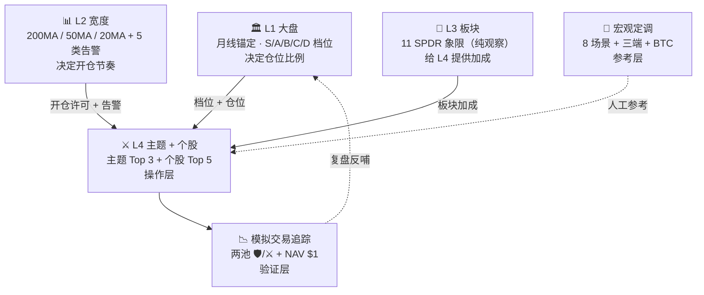

# 核心逻辑

<aside>
🧠

**系统大脑**。所有交易规则、信号定义、执行优先级的权威文档。具体参数阈值统一存放在 [参数中心](https://www.notion.so/28c61e309a6644ffaaa01519f133a47a?pvs=21)，本页聚焦**语义、逻辑、规则关系**。

</aside>

<aside>
⚠️

**修改授权规则**：本页每次修改需用户显式授权。小范围参数调整走 🎛️ 参数中心，不动本页结构。

</aside>

## 📖 §0 导读

### 读这份文档的顺序

1. **§1 系统定位** — 先明白"干什么，不干什么"
2. **§2 四层框架** — 看懂整个大脑怎么分工
3. **§3-§7** — 按层级逐层下钻（L1 大盘 → L4 个股）
4. **§8-§10** — 层间协作与信号执行
5. **§11-§13** — 宏观定调、模拟交易、日报输出
6. **§14-§15** — 数据基础设施与路线图

### 参数查询

所有具体数字（阈值、窗口、权重）在 [参数中心](https://www.notion.so/28c61e309a6644ffaaa01519f133a47a?pvs=21)。本页只说"为什么这样设"，不说"具体是多少"。

### 变更记录

结构性变更进 [架构决策记录 ADR](https://www.notion.so/ADR-9cd2d1722b49425d9ecb8dca378e3347?pvs=21)。

## 🎯 §1 系统定位与边界

### §1.1 系统目的

- **角色**：美股波段交易选股 + 出入场信号系统
- **产出**：每日 ETF Top 3 + 个股 Top 5 + 档位 + 宏观定调 + 模拟账户 NAV
- **不管**：真实仓位、实盘执行、税务、资金流动

### §1.2 边界约束

- **市场隔离**：与 CN Stock Research 完全隔离，A 股经验不迁移
- **标的池**：ETF 池 ~89 只（精选主题 + 板块 + 宽基），个股池 ~1,100 只（IVV + IJH + IJR + QQQ 外国成员 + IPO，ADR-023 硬过滤后；详见 §7.1）
- **时间基准**：日线，周线月线作为趋势锚定
- **模拟起点**：2025-01-01（FMP Starter 5 年数据窗口；接受冷启动前约 4 个月 5 年分位样本不足，见 ADR-014）

### §1.3 核心原则

- **市场公认 + 近 5 年双轨校准**（跨牛熊）
- **Level 3 板块 = 纯观察**，不下沉个股操作，只通过板块加成影响 Level 4 综合分
- **宏观不入算法**，只做展示 + 人工判断参考
- **档位 S/A/B/C/D**（S=120% / A=100% / B=80% / C=60% / D=20%），**非空仓系统**
- **模拟账户与信号池隔离**，§6/§7 不被持仓污染

## 🏗 §2 四层框架总览



### §2.1 四层分工

| 层 | 回答什么 | 产出 | 性质 |
| --- | --- | --- | --- |
| **L1 大盘** | 整体能不能交易？仓位多大？ | S/A/B/C/D 档位 | **决定层** |
| **L2 宽度** | 开仓节奏？有无系统性风险？ | 宽度分位 + 告警 | **节奏层** |
| **L3 板块** | 哪些板块在强势？ | 11 SPDR 象限 + 加成 | **观察层** |
| **L4 主题+个股** | 具体做什么？ | ETF Top 3 + 个股 Top 5 | **操作层** |

### §2.2 冲突优先级

**L1 > L2 > L3 > L4**。L1 降档直接压缩 L4 仓位；L2 告警可单独触发出场；L3 加成永远不能单独启动 L4 买入。

## 🏛 §3 L1 大盘档位系统

### §3.1 五档定义

<aside>
📌

**SSOT · 本节为档位定义唯一真源。** 主页速览、[参数中心](https://www.notion.so/28c61e309a6644ffaaa01519f133a47a?pvs=21) §1、[新对话启动指南](https://www.notion.so/3f72c1f537dd45efbb277f4968638010?pvs=21)、[日报输出格式](https://www.notion.so/658060c74741479390e5629ae988e7ac?pvs=21) 均引用本表。修改档位数值 / 语义 / 触发条件后需复核所有引用位置。

</aside>

| 档位 | 仓位 | 语义 | 典型场景 |
| --- | --- | --- | --- |
| **S** | 120% | 进攻 | 4 硬门槛 + 任一动能共振 × 连续 3 日（详 §3.4a） |
| **A** | 100% | 标准 | QQQ 趋势强 · VIX 低位或回落 · 无重大事件压顶 |
| **B** | 80% | 打折 | 大盘趋势未坏但不流畅 / VIX 中性偏紧 / 临近事件 |
| **C** | 60% | 守势 | 200MA 被跌破 / 宽度弱势 / VIX 持续上行 |
| **D** | 20% | 试水 | 熊市确认 / 极端恐慌 / 系统性风险 |

<aside>
💡

**S 档不是单纯 A 的放大**，是需要"多个强势指标同时共振 + 连续天数确认"才能进入的进攻档。详见 §3.4。

</aside>

### §3.2 三指标量化

档位由三个维度共同决定：

1. **SPY 趋势**：价格 vs 200MA / 50MA / 20MA 的排列关系 + 月线新高
2. **VIX 双轨**：绝对水平（近 5 年分位）+ 方向（10 日变化率）
3. **宽度方向**：L2 宽度总评分（见 §4）

阈值详见 [参数中心](https://www.notion.so/28c61e309a6644ffaaa01519f133a47a?pvs=21) §1。

### §3.3 VIX 双轨机制

| 维度 | 阈值 | 窗口 | 触发 |
| --- | --- | --- | --- |
| 绝对水平 | P20 / P50 / P80 | **近 5 年** | 跨档位 |
| 方向（10 日变化率） | ±15% | 固定 | 即时 |

**双轨冲突处理**：方向恶化（快速上行）优先于绝对低位 → 即使 VIX < P20，若 10 日涨 > 15%，也压半档。

### §3.4 档位决策矩阵

```jsx
SPY 趋势 + VIX 方向 + 宽度评分 → 档位

4 硬门槛 + 任一动能 × 3 日确认 → S  (详见 §3.4a)
同向正常 → A
方向分歧（1-2 项偏弱）→ B
2+ 项负面 → C
全面负面 + VIX 极高 → D
```

升降档规则：一次最多跳一档，极端事件（如 VIX 单日 +30%）可跳两档。详见 [参数中心](https://www.notion.so/28c61e309a6644ffaaa01519f133a47a?pvs=21) §1.4。

### §3.4b 防抖冷却期

**不对称冷却（ADR-020）**：

- **A→S 回升**：距上次离 S ≥ 5 个交易日方可重新升 S，且仍需满足 §3.4a 4 硬 + 任一动能 × 3 日
- **相邻同向**：A/B/C/D 相邻档位同向切换最短间隔 2 个交易日
- **降 S→A**：任一硬门槛破坏立即降（不受冷却限制）
- **跳档豁免**：跨档切换（如 A→C、VIX 单日 +30% 等极端事件）不受冷却限制

冷却参数详见 [参数中心](https://www.notion.so/28c61e309a6644ffaaa01519f133a47a?pvs=21) §1。

### §3.4a S 档触发量化（市场公认 · 4 硬 + 1 软 + 3 日）

**硬门槛（全部满足）**：

1. **趋势**：SPY 当日新高 或 距月线新高 ≤ 3%
2. **广度**：200MA 宽度 ≥ P85（近 5 年）
3. **波动**：VIX < P20（近 5 年）且 10 日均值 < P30
4. **事件窗**：未来 7 日内无 FOMC / CPI / NFP / 大选

**动能确认（任选 1）**：

- 50MA 宽度 ≥ 70%
- 新高新低比 NH/NL ≥ 3
- McClellan Oscillator ≥ +50

**时间确认**：4 硬 + 任一动能 **连续 3 个交易日** 同时成立 → 升 S。

**降档**：任一硬门槛破坏 → 立即降至 A（不需确认天数）。

**频率预期**：牛市典型 2-4 次/年 · 单次 2-8 周 · 年在 S 档天数占比 10-20%。

**参考来源**：IBD Market School "Confirmed Uptrend" / Zweig Breadth Thrust / Stan Weinstein Stage 2 综合。

阈值详见 [参数中心](https://www.notion.so/28c61e309a6644ffaaa01519f133a47a?pvs=21) §1a。

## 📊 §4 L2 市场宽度

### §4.1 200MA 宽度三档

- 使用 SP500 中股价在 200MA 之上的占比
- 分位窗口：**近 5 年**
- P80 / P50 / P20 三档阈值，对应"系统强 / 中性 / 系统弱"

### §4.2 50MA 宽度三角色

#### §4.2a 极值

- 窗口：**近 5 年**
- 触发：P95 / P5 极值告警
- 含义：超买/超卖，需看是否叠加 §4.6 顶部背离

#### §4.2b 极值双档

- P90-P95 一级预警（🟡）
- P95+ 二级预警（🔴）

#### §4.2c 钝化检测

- 窗口：**近 2 年**（Message 97 最终修正）
- 原因：5 年窗口会把远期熊市拉稀释识别力；2 年窗口保留识别灵敏度且覆盖近期市场特征
- 触发：连续 N 天在 P75+ 未回落
- 含义：极值钝化 = 可能形成顶部

### §4.3 加速度量化

- 定义：50MA 宽度 5 日变化率
- 用途：识别"宽度正在恶化"or"正在改善"
- 耦合到档位升降

### §4.4 持续确认窗口

- **单日触发**：仅入观察
- **连续 2 天**：一级告警
- **连续 3 天**：纳入档位调整
- **连续 5 天**：结构性变化

### §4.5 日度输出 + 耦合 L1

宽度总评分 → 档位调整输入。宽度恶化（评分 < 30）时即便 SPY 趋势未坏，也压至少一档。

### §4.6 顶部背离

- 窗口：**20 日高点**（不涉分位）
- 规则：指数新高 + 宽度不新高（差 > 5%）
- 触发：档位降 0.5 档 + 日报单独 🚨 提示

### §4.7 底部反转通道

- 窗口：**近 5 年**
- 规则：VIX 从 P95+ 回落至 P80 以下 + 宽度 P5 反转回 P20+
- 触发：允许从 D 档试探性升至 C 档

### §4.8 McClellan

- MO 主指标 + SUMM 趋势确认
- 辅助决策，不单独触发档位

## 🧭 §5 L3 板块轮动（纯观察）

### §5.1 11 SPDR 五维评分

五维：**价格趋势 / RS 强度 / 宽度 / 资金流 / 波动率**。

- 复合 RS 窗口：**近 5 年**
- 每维 0-100 分，五维加权合成总分
- 总分 → 5 象限（🚀 领涨 / 🔥 强势 / 🔄 中性 / ❄️ 弱势 / 💀 落后），映射规则详 §5.1a

### §5.1a 总分 → 象限映射（双轨法 · 市场公认）

**双轨设计**：避免"瘸子里挑将军"。单看当日排名会在熊市里也强行选出"领涨"板块；单看绝对分位会在牛市时所有板块都升到领涨。双轨取更保守 → 只有**相对强 + 绝对也强**才算真领涨。

**相对轨**（当日 11 只 SPDR 横截面排名切 5 段）：

| 象限 | 排名 | 只数 |
| --- | --- | --- |
| 🚀 领涨 | Top 1-2 | 2 |
| 🔥 强势 | 3-4 | 2 |
| 🔄 中性 | 5-7 | 3 |
| ❄️ 弱势 | 8-9 | 2 |
| 💀 落后 | 10-11 | 2 |

**绝对轨**（板块自身总分 5 年分位地板，限制最高象限）：

| 板块自身 5 年分位 | 允许最高象限 |
| --- | --- |
| ≥ P70 | 🚀 领涨 |
| P50-P70 | 🔥 强势 |
| P30-P50 | 🔄 中性 |
| < P30 | ❄️ 弱势 |

**最终象限 = min(相对轨候选, 绝对轨允许最高)** — 级别上取低。例：某板块今日相对排名第 1（候选 🚀 领涨），但自身 5 年分位仅 P45（允许最高 🔄 中性） → 最终归入 🔄 中性（×1.00）。

**频率预期**：

- **牛市背景**：绝对轨普遍满足，按相对轨出 2/2/3/2/2
- **熊市背景**：绝对轨压制，可能 0 领涨 / 0 强势 / 3 中性 / 4 弱势 / 4 落后
- **分化市**：1-2 领涨 + 3-4 中性 + 其余弱

**参考来源**：IBD Sector Leaders（Relative Strength Ranking）/ SPDR SSGA Sector Rotation Wheel / Fidelity Sector Quintile 综合。

系数对应详 [参数中心](https://www.notion.so/28c61e309a6644ffaaa01519f133a47a?pvs=21) §10。

### §5.2 驱动修正

- **催化标记**：利率、美元、油价、财报季等宏观因子标记板块风向
- 修正评分 ±10%

### §5.3 子板块下沉

- 11 SPDR 下可沉到 GICS 二级（如半导体、软件、生物制药）
- 不改变 L3 纯观察性质，只增加粒度

### §5.4 逆风例外

- 窗口：**近 5 年** P85
- 规则：板块整体弱，但某子板块或个股 RS > P85 + 成交量确认
- 触发：允许 Level 4 破格买入，日报标注"⚠ 逆风例外"

## ⚔️ §6 L4 主题主线

### §6.1 定义与边界

- **主题 ≠ 板块**：主题是跨 GICS 的动量主线（如 AI / 重工业回归 / 国防）
- 主题列表在 [Hermes SOP](https://www.notion.so/Hermes-SOP-bd80827bbaf942a399dccb2a818f3063?pvs=21) 动态维护

### §6.2 三段篮子

每个主题分三段：

- **核心股**：主题最纯标的
- **扩散股**：关联受益股
- **概念股**：沾边但不纯的（V4 启动期预留空,待 Hermes 首次完整调研补,见 ADR-028）

**三段权重（V4 启动期）**：核心 70% / 扩散 30% / 概念 0%（预留）

**三段权重（V5 目标）**：核心 60% / 扩散 30% / 概念 10%。

### §6.3 状态机

主题分四态：**孕育 → 启动 → 加速 → 衰减**。

#### §6.3a 孕育 → 启动

- 核心股 RS > P70
- 主题成交占大盘 > 5%
- 至少 3 只核心股同步突破

#### §6.3b 启动 → 加速

- 主题分数进前 3
- 核心股 50MA 多头排列 > 80%

#### §6.3c 主题量能双控（Message 99 最终）

- **中级 🟡**：近 1 年 P80 + 20D 日均成交 ≥ 3 月均 × 2x
- **高级 🔴**：近 1 年 P95 + 20D 日均成交 ≥ 3 月均 × 3x + 放量拉升后次日阴线
- **Fallback**：主题 ≥ 6 月但 < 1 年 → 用成立以来窗口 + 日报标注"⚠ 样本不足"
- **< 6 月主题**：暂停量能预警

#### §6.3d 加速 → 衰减

- 双控 🔴 触发 + 连续 3 天未创新高
- 核心股 RS 集体回落至 P50 以下

### §6.4 Top 3 输出

每日选分数最高的 **3 个主题**，每个主题带 ETF 代表 + 3 只核心股 + 操作建议。

## 🎯 §7 L4 个股执行

### §7.1 个股池

- **装载源(ADR-022)**:IVV(S&P 500)+ IJH(MidCap 400)+ IJR(SmallCap 600)+ QQQ 外国成员(NDX 100 里非 IVV/IJH/IJR)+ Renaissance IPO ETF
- **硬过滤(ADR-023,同时满足)**:市值 ≥ $1B · 20D 日均成交额 ≥ $10M · ipoDate ≥ 90 日 · actively_trading = true
- **去重优先级(ADR-025)**:IVV > IJH > IJR > QQQ_intl > IPO > hermes > manual(首次出现保留)
- 去重 + 硬过滤后准入样本约 **1,100 只**

### §7.2 综合分 + 板块加成

- **综合分 = 技术分 60% + 基本面分 25% + 主题加成 15%**
- 板块加成：L3 板块象限（详 §5.1a）→ ×0.90 ~ ×1.10（5 档系数，详 [参数中心](https://www.notion.so/28c61e309a6644ffaaa01519f133a47a?pvs=21) §10）
- 逆风例外触发：+ 20%

### §7.3 入场范式

三类入场：

- **突破**：创 20 日高点 + 成交量 > 20D 均 1.5x
- **回踩**：跌至 50MA / 20MA 支撑 + MACD 底背离
- **事件**：财报超预期 / 分析师上调 / 催化剂

### §7.4 初始止损

- 技术止损：最近摆动低点 - 3%
- 比例止损：入场价 × 0.92（最大 8% 容忍）
- 取两者更靠近的

## 🔀 §8 四层优先级与冲突

### §8.1 优先级

L1 > L2 > L3 > L4（再次强调）

### §8.2 冲突场景

- **L1 降档 + L4 强信号**：按 L1 档位压缩仓位，不取消信号
- **L2 告警 + L3 领涨**：告警优先，暂停新开仓
- **L3 逆风 + 个股强**：允许破格（§5.4），但仓位减半

## 🧾 §9 候选 → 观察池映射

### §9.1 候选生成

每日信号计算产出"候选池"（约 30-50 只）。

### §9.2 观察池晋级

候选需连续 2 天在 Top 20 → 进入"观察池"（人工关注）。

### §9.3 买入池

观察池中信号继续加强 + 综合分 > P80 → 进入"买入池"（模拟账户会执行）。

## 🎬 §10 出入场信号规则

### §10.1 入场

- **买入池**中当日触发入场范式（§7.3）之一
- 仓位：档位仓位 × 50%（首仓），见 [模拟交易追踪系统](https://www.notion.so/7ab8a36758d54ec687e7d1e757d41308?pvs=21)

### §10.2 加仓

- 首仓浮盈 > 5% + 创新高 + 不破 10D EMA：加 30%
- 再浮盈 > 10% + 不破 20D EMA：加 20%

### §10.3 出场

详见 [模拟交易追踪系统](https://www.notion.so/7ab8a36758d54ec687e7d1e757d41308?pvs=21) 7 触发链。

**优先级明文（ADR-019）**：① 硬止损 · ② D 档强平 · ③ MA 破位 3 日 · ④ 分段止盈 · ⑤ 拉伸报警 · ⑥ 主题量能 🔴 减仓 · ⑦ 跌出 Top N 换仓。**5D 最小持有期仅约束 ⑦（主动换仓）**，①-⑥（风险 + 止盈 + 拉伸 + 主题减仓）一律即时执行。

## 🧭 §11 宏观定调

### §11.1 定位

- **不入算法**，纯展示 + 人工判断
- 每日日报置顶（在 L1 大盘之前），作为"今日市场心态"的上下文

### §11.2 8 场景定义

| 场景 | 特征 | 行业倾向 |
| --- | --- | --- |
| **Risk-on 扩张** | 利率稳 + 美元弱 + HYG 强 | 科技 / 成长 / 小盘 |
| **Risk-off 避险** | 利率升 + 美元强 + HYG 弱 | 防御 / 公用 / 必消 |
| **滞胀** | 利率升 + 油价升 + 金强 | 能源 / 黄金 / 大宗 |
| **通缩恐慌** | 利率跌 + 油价跌 + 金跌 | 国债 / 防御 |
| **再通胀** | 利率升 + 油价升 + BTC 强 | 工业 / 金融 / 材料 |
| **衰退预警** | 10Y-2Y 倒挂 + HYG 弱 | 现金 / 防御 / 黄金 |
| **宽松预期** | 利率跌 + 美元弱 + 成长抢跑 | 科技 / REITs / 成长 |
| **紧缩恐慌** | 利率急升 + 美元急升 + 股债双杀 | 现金 / 空头 |

### §11.3 三端确认

- **信用端**：HYG / LQD 相对强度
- **避险端**：金银比
- **风险偏好端**：**BTC**（方案 A，Message 76 确认）

三端共振 = 场景确认；分歧 = 混沌期，保守对待。

### §11.4 辅助指标

- IEF（7-10Y 国债）
- DXY（美元指数）
- WTI（油）
- 10Y-2Y 息差

### §11.5 操作建议

每日场景 + 三端 → 输出"今日操作建议"（加仓 / 减仓 / 持仓 / 现金）。

## 📉 §12 模拟交易追踪

<aside>
🔗

完整规则在 [模拟交易追踪系统](https://www.notion.so/7ab8a36758d54ec687e7d1e757d41308?pvs=21)。本节仅列核心概念。

</aside>

### §12.1 两池架构

- **🛡️ ETF 池**：稳健，主题 ETF Top 3 轮动
- **⚔️ Stock 池**：进攻，个股 Top 5 轮动
- 各 NAV $1 起步，2025-01-01 起跑

### §12.2 NAV 与交易

- NAV 每日收盘计算
- 手续费：0.05% 单边
- 滑点：ETF 0.05% / 个股 0.1%
- T+0（美股规则）
- S=120% 不算利息

### §12.3 建仓与止盈

- **50 / 30 / 20 三段建仓**
- **R 倍三段止盈**：+1R / +2R / +3R 分别卖 1/3
- **50MA + 10ATR 拉伸出场**

### §12.4 7 触发链

详见模拟交易追踪系统页，含：止损 / 止盈 / 拉伸 / 宽度告警 / 档位降级 / 主题衰减 / 个股事件。

### §12.5 最小持有

5 个交易日（仅约束换仓，不约束止损）。

### §12.6 信号池与模拟盘的单向流

模拟账户持仓 / NAV / trades **不得反向影响** §6 主题评分和 §7 个股综合分，保持信号纯净。代码层约束详见 [模拟交易追踪系统](https://www.notion.so/7ab8a36758d54ec687e7d1e757d41308?pvs=21)「🔒 信号池隔离 + 双运行模式」+ [架构决策记录 ADR](https://www.notion.so/ADR-9cd2d1722b49425d9ecb8dca378e3347?pvs=21) **ADR-017**（三段表清单 + 4 条 CI 断言 + live/backtest 双运行模式物理隔离）。

## 📤 §13 每日输出

<aside>
🔗

完整模板在 [日报输出格式](https://www.notion.so/658060c74741479390e5629ae988e7ac?pvs=21)。

</aside>

### §13.1 双版分工

- **Notion 完整版**（9 板块，存档 + 学习）
- **Discord 简要版**（6 板块，手机速览）

### §13.2 9 板块（完整版）

1. Header（日期 + 档位 + 价格块）
2. 🧭 宏观定调
3. L1 大盘
4. L2 宽度
5. L3 11 SPDR
6. L4 ETF Top 3
7. L4 个股 Top 5
8. 📉 模拟交易追踪
9. 风险提示

### §13.3 Discord 简要版差异

- 删指数价格块
- 宏观展开（文字详述）
- 保留买点/止损
- 精简 NAV

## 🌱 §A · A 池长线 thesis 技术择时系统(平行旁路)

<aside>
🌳

**双轨命名**：本节"A 池" = UI 展示的**长线池(Long Pool)**· 后端代号 a_pool 不变 · 表 `signals_a_pool_daily` / `a_pool_calibration` 不动。前文 §1-§16 描述的主算法适用于**短线池(M 池 · m_pool)** · 全市场 ~2000 只动量波段。两池共用 M2 数据流水线但信号链物理隔离(详见 §A.8 + ADR-030)。

</aside>

<aside>
🔗

**完整设计 + 权衡** 详见 [架构决策记录 ADR](https://www.notion.so/ADR-9cd2d1722b49425d9ecb8dca378e3347?pvs=21) ADR-030。本节聚焦语义、信号定义、评分规则。具体阈值与权重见 [参数中心](https://www.notion.so/28c61e309a6644ffaaa01519f133a47a?pvs=21) §12。

</aside>

### §A.1 系统定位

- **角色**:针对 watchlist 中 `thesis_status='active'` 的长线票 · 每日给技术择时信号
- **产出**:11 类信号 + 三维评分 + 三层入场点 + 两层止损 + 短期目标 + 一句话判断
- **不做**:不管仓位 · 不算 M/A 搭配 · 不进模拟盘 NAV(M/A 战绩对比走未来 A-S4)
- **与 M 隔离**:共用 M2 数据流水线 · 信号链物理隔离(独立表 + 互不 SELECT · ADR-030)

### §A.2 Per-symbol 历史画像(核心创新)

每票挖 5Y 历史出"性格" · 写入 `a_pool_calibration` 表 · 周一凌晨增量刷新。

- **典型洗盘深度**:上行段中位回撤(NVDA ~-9% · KO ~-4% · TSLA ~-14%)
- **深度洗盘**:90 分位回撤(罕见但重复发生)
- **极端洗盘**:95-99 分位(黑天鹅)
- **历史强支撑**:3-5 个价格密集区(K-means 聚类历史反弹点)
- **个性化 RSI 阈值**:5Y RSI 5%/95% 分位(代替统一 30/70)
- **典型上涨段长度 + 幅度**:决定 target 推算窗口
- **β 稳定性**:5Y 滚动 β 标准差(小 = 可靠)

### §A.3 11 类信号

**入场类(B 类 · 5 信号)**

- **B1** 回踩确认:回踩 ±3% MA20/50 + 3 日内放量阳线
- **B2** 突破阻力:拆 B2a 初突破(警告)+ B2b 回踩不破(才入场)
- **B3** 超卖反转:RSI 上穿**画像表个性化 5% 分位**
- **B4** 均线金叉:20/50 金叉 + 5 日内新鲜度
- **B5** 强支撑反弹:触及画像表 strong_supports + 阳线收回

**出场类(S 类 · 4 信号)**

- **S1** 跌破支撑:跌破 50MA + 3 日不收回 + 50MA 斜率下行
- **S2a** 初步死叉警告:20/50 死叉(警告 · 不强制)
- **S2b** 深度死叉:50/200 死叉(强警告 · 等同 thesis 失效)
- **S3** 量价背离:90D 内 ≥ 2 次新高 OBV/RSI 背离

**警示类(W 类 · 2 信号 · 不直接驱动)**

- **W1** 进入历史"过热区":距 52W 高 < 3% + RSI > 个性化 95 分位
- **W2** thesis 时间老化:thesis 持有 > N 月未兑现 · 提示队长复核

每个信号触发必须附 **explanation**(人话解释)+ **hist_ref**(历史对照:过去 N 次类似形态 · 30D 后平均涨跌 X%)· 多区间回测(3Y/5Y/10Y 三档防过拟合)。

### §A.4 三维评分(0-100)

**1. 弹性分(权重 35%)** · 衡量"动一下能涨多少"

- ATR% 横向分位(40%):A 池内 12-20 个票横向比
- β 分段适配(30%):β 1.0-1.3 = 60 / 1.3-1.8 = 100 / 1.8-2.5 = 80 / >2.5 = 40 / <1.0 = 30
- 20D σ 横向分位(30%):波动率分布

**2. 性价比分(权重 30%)** · 衡量"现在便不便宜"

- 价值原始分:距 52W 低点(30%) + 距 200MA(30%) + 回撤深度(40%)
- × 趋势健康系数(0.50-1.00):基于 200MA 20D 斜率(防抓底死)

**3. R:R 分(权重 35%)** · 拆战略 + 战术

- **战略 R:R** = (target_price - close) / (close - thesis_stop) · 仅作过滤(<2 禁加仓)
- **战术 R:R** = (next_resistance - close) / (close - tactical_stop) · 真正打分
    - tactical_stop = max(50MA × 0.95, 入场均价 × 0.92, 近 20D 支撑)
    - 阶梯:≥ 3.0 → 85-100 / 2.0-3.0 → 60-85 / 1.5-2.0 → 30-60 / <1.5 → 0

**A_Score** = 弹性 × 0.35 + 性价比 × 0.30 + R:R × 0.35

- 信号加成(同时 ≥ 2 个 B 信号 · +5)
- 三维一致性扣分(任一 <50 · -10)

范围 [0, 100]

### §A.5 过滤层

**硬过滤(任一不过 → 当日不评分 · 输出 hold)**

- **F1** 流动性:20D 均成交额 ≥ $10M(防流动性陷阱)
- **F2** 价格连续性:近 5 日无 ±15% 跳空(防财报黑天鹅未消化)

**软过滤(扣分 · 不禁止)**

- **F3** 三维一致性:任一 < 50 → A_Score -10(防三维冲突的怪票)

### §A.6 三层入场点 + 两层止损 + 短期目标

- **入场点 3 层**:
    - 激进 = 当前价(信号已确认即入)
    - 保守 = 画像表 typical_pullback 位
    - 极保守 = 画像表 deep_pullback 位
- **止损 2 层**:
    - 浅 = 强支撑 1 击穿
    - 深 = 强支撑 2 击穿
- **短期目标**:近 60D 高点 / 画像表 typical_uptrend_gain 推算

### §A.7 输出 · 个股看板格式

每日每个 active 票一张卡 · 写入 Notion + Discord 简版。

包含:位置评估 + 历史画像参考 + 触发信号(含 explanation + hist_ref)+ 出入点建议(三层入场 / 两层止损 / 目标 / 战术 R:R)+ 三维评分 + verdict_text。

verdict_text 生成 = 规则骨架 + Vertex AI Gemini 2.0 Flash 润色(成本约 $0.3/年 · 详 ADR-030)。

### §A.8 与 M 主算法的物理隔离

- **共享**:M2 数据流水线(`quotes_daily` / `etf_holdings_latest` / `macro_daily`)
- **独立**:`a_pool_calibration`(画像)+ `signals_a_pool_daily`(日信号)两张表
- **约束**:M 算法 SELECT 不访问 A 表 · A 引擎 SELECT 不写 M 表(类比 §12.6 + ADR-017 信号池隔离)
- **共用输出层**:Notion 日报 + Discord · 但板块物理分开(A 池个股看板 / M 9 板)

### §A.9 调度

- **calibrate-a-pool-job** · Cloud Run Job · Scheduler 周一凌晨 1 点(北京)· 周更画像
- A 池信号引擎挂在 `signals-daily-job` S1 阶段(每个美股交易日早 6 点北京时间 · 复用 orchestrate)

## 🗄 §14 数据基础设施

<aside>
🔗

技术细节在 [Cloud Run 部署方案](https://www.notion.so/Cloud-Run-a6b3fc28e5f341789442133653585c0d?pvs=21)。

</aside>

### §14.1 存储(ADR-027)

- **Cloud SQL Postgres 15** db-f1-micro(primary · 20+ 表 · ~$10/月 · 实例 `naive-usstock-db` · us-central1)
- **GCS** 单 bucket `naive-usstock-data` + 两个 prefix:`bootstrap/` (M1 Parquet 快照,灾难恢复源)· `cold/` (V4 预留,不建;触发条件见 ADR-027)
- backtest 本地保留 SQLite `backtest.db`(只写模拟盘 state · 行情走 cloud-sql-proxy 只读连 Cloud SQL)
- 选型与 tier 升级触发条件详见 [架构决策记录 ADR](https://www.notion.so/ADR-9cd2d1722b49425d9ecb8dca378e3347?pvs=21)

### §14.2 关键数据表

- `quotes_daily` / `quotes_intraday`
- `nav_daily` / `positions_current` / `trades_log` / `stage_entries`
- `themes_master` / `themes_members` / `themes_score_daily` / `themes_volume_daily` / `themes_lifecycle`
- `sp500_members_daily`（历史成分股，防幸存者偏差）
- `etf_holdings_latest` / `etf_holdings_snapshot`
- `macro_daily`（三端 + 辅助）
- `fetch_errors` / `alert_log`

### §14.3 数据回填与起跑

- **数据回填起点**：今日回推 5 年（FMP Starter 上限，约 2021-04 起）
- **模拟盘起跑**：**2025-01-01**（ADR-014 锁定）
- **冷启动精度降级**：2025-01-01 之后约 4 个月，5 年分位窗口样本不足 → 日报自动标注 "⚠ 样本不足"
- **日常增量**：每日 Cloud Run Job 拉增量

## 🗺 §15 路线图与版本

### §15.1 当前状态

- **V4 Mock 锁定**（2026-04-24）
- 9 板块 + 9 处差异化分位 + 双池 NAV + 形态 tag 全部封顶

### §15.2 差异化分位窗口（V4 最终）

| 位置 | 用途 | 窗口 |
| --- | --- | --- |
| §3.3 VIX 双轨 | 绝对阈值校准 | **5 年** |
| §4.1 200MA 三档 | 绝对阈值校准 | **5 年** |
| §4.2b 宽度极值 | 绝对阈值校准 | **5 年** |
| §4.2c 钝化 | 当下正常区间 | **2 年** |
| §4.6 顶部背离 | 即时对比 | **20 日高点** |
| §4.7 底部反转 | 绝对阈值校准 | **5 年** |
| §5.1 复合 RS | 绝对阈值校准 | **5 年** |
| §5.4 逆风例外 | 绝对阈值校准 | **5 年** |
| §6.3c 主题量能 | 主题生命周期 | **1 年 P80/P95 + 20D × 2x/3x** |

### §15.3 下一阶段

- **Phase 4 技术部署**（见 [Cloud Run 部署方案](https://www.notion.so/Cloud-Run-a6b3fc28e5f341789442133653585c0d?pvs=21)）
- 冷启动回测
- ETF 追踪池 + 美股观察池自动填充脚本
- 近 5 年阈值校准 V2（目前用市场公认 V1）

### §15.4 预留升级空间

- 光模块细分篮子成员
- 其它自组篮子
- 个人关注股票清单
- Hermes 首次完整调研
- 盘中紧急推送（突发事件）
- 实盘桥接（IBKR / Alpaca）

## 📚 §16 参数索引

**所有具体参数阈值，查** [参数中心](https://www.notion.so/28c61e309a6644ffaaa01519f133a47a?pvs=21)。

10 大参数组：

1. L1 大盘档位阈值
2. L2 宽度分位阈值
3. L3 板块评分权重
4. L4 主题状态机阈值
5. L4 个股综合分权重
6. 模拟交易参数（建仓 / 止盈 / 止损）
7. 宏观三端阈值
8. 数据源参数（FMP / yfinance）
9. 风控参数（最大回撤 / 连续亏损熔断）
10. 日报输出参数

## 🏷 §17 修订历史

- **V4.0.11**(2026-04-28):ADR-030 — 新增 §A · A 池长线 thesis 技术择时系统(平行旁路)· 11 类技术信号(5 入场 / 4 出场 / 2 警示)+ 三维评分(弹性 35% / 性价比 30% / R:R 35%)+ per-symbol 历史画像(`a_pool_calibration` 表 · 周更)+ 三层入场点(激进 / 保守 / 极保守)+ 两层止损(浅 / 深)+ verdict_text(规则骨架 + Vertex AI Gemini 2.0 Flash 润色 · ~$0.3/年)· **仅给信号不管仓位** · 信号链与 M 物理隔离 · 共用 M2 数据流水线 · 调度 `calibrate-a-pool-job` 周一 01:00 + 信号挂 `signals-daily-job` S1。[参数中心](https://www.notion.so/28c61e309a6644ffaaa01519f133a47a?pvs=21) 新增 §12。
- **V4.0.5**（2026-04-24）：ADR-018/019/020/021 — §3.4 新增 §3.4b 档位防抖冷却（A→S 5 日 / 相邻 2 日 / 降 S 即时）· §10.3 明文 7 触发链优先级 + 5D 仅约束换仓类 · 配套幂等性 + 日报双层持久化落到部署方案和日报格式 · Hermes 调研节奏锚定每季度第一个月（1/4/7/10 月触发，SOP 已有）· 个股池装载源走 FMP ETF Holdings 端点（ADR-022）+ 底池质量硬过滤（ADR-023）补齐 Hermes 搁置期质控缺位。
- **V4.0.10**(2026-04-24):ADR-028 — themes.yaml 种子采用 **C 混合路径**(Codex `scripts/generate_themes_from_etf.py` 从 `algo_role=L3_theme` ETF 反推 → 用户人工 review 草案 → PR merge `config/themes.yaml`)· §6.2 三段权重 V4 启动期简化为 **70/30/0**(概念段预留,V5 Hermes 调研后补)· 月度 M2 curation 微调新主题发现 / 拆分 / 合并。ETF 审核池 `algo_role` 字段 100% 填写为前置阻塞。
- **V4.0.9**(2026-04-24):ADR-027 — 数据库选型 invariant 锁定:**Cloud SQL Postgres 15 · db-f1-micro**(primary · ~$10/月)· GCS 仅做 bootstrap 快照 + 5 年冷归档 · backtest 本地 SQLite `backtest.db`(行情走 cloud-sql-proxy 只读共享 live SoT,模拟盘 state 物理隔离)。精确化 §14.1 + ADR-024 L-Data 层;ADR-017 `main.db` 命名废弃(live 改 Cloud SQL schema,P2 backlog 清理)。预留 tier 升级触发条件(数据 > 50GB / 查询 > 5000 次/日 / p95 > 500ms)。GCP Billing Budget Alert 建议 $50/月。
- **V4.0.8**(2026-04-24):ADR-026 + ADR-025 修正 — 部署层明文**三阶段分离**:**M1 本地 Bootstrap**(一次性全量历史 · `bootstrap_history.py`)· **M2 本地 Curation**(月度人工 diff · `curate_universe.py` 聚合 ETF + 个股)· **M3 云端 Operate**(写死只读 · 每日 Cloud Run Job)。云端**零配置决策权**:不写 CSV · 不改 params · 不维护 universe · 仅读配置 + 读写行情 + UPSERT 日报。ADR-025 同步修正:`refresh_universe.py` 从 Cloud Run 月度 cron 改为**本地手动**,个股 / ETF 统一走 diff → PR 流程。ADR-024(数据层)与 ADR-026(部署层)**正交 invariant**。可扩展至 M4 实盘桥接 / 多市场 / 换数据源零改动 M2/M3。
- **V4.0.7**(2026-04-24):ADR-025 — 动态成员管理规则落地:**个股月度自动准入 + 软退休**(`is_candidate=false` 保留数据 · PIT `as_of_date` 分区防 survivorship bias)· **ETF 本地审批 diff 流**(Cloud 冻结 CSV + 本地 `discover_etf_candidates.py` 输出 diff → 用户 PR merge)· **多源优先级去重**(IVV > IJH > IJR > nasdaq_intl > renaissance_ipo > hermes > manual · 首次出现保留)· CSV schema 新增 `algo_role` + `source_discovered` · Cloud SQL `symbol_universe` 加 `as_of_date` · 参数中心 SoT 定案迁 `config/params.yaml`(Notion 仅镜像展示)。可扩展至 HK 股 / 期权 / 第三方主题 ETF 发现。
- **V4.0.6**(2026-04-24):ADR-024 — 确立**四层分离架构**（L-Config 配置 / L-Data 数据 / L-Research 调研 / L-Output 输出）与**数据单向流动原则**。Notion 仅承担输出展示（日报 DB / 归档），算法不读 Notion 字段；所有配置与数据 source-of-truth 迁到 `config/*.csv` + `config/*.yaml` + Cloud SQL。ETF 审核池退休为一次性种子（→ `etf_universe.csv`）· Hermes §8 ETF 同类选优废弃 · `is_candidate` 软开关（false 不参与信号但数据继续维护）。可扩展至 HK 股 / 期权 / 多数据源 / 多输出类型。
- **V4.0.4**（2026-04-24）：ADR-017 — §12.6 信号池单向流落到代码层（三段表清单 + 4 条 CI 断言 + live/backtest 双运行模式部署隔离）。
- **V4.0.3**（2026-04-24）：ADR-016 — §5.1a L3 象限映射双轨法（相对轨横截面排名 + 绝对轨 5 年分位地板，取保守）。
- **V4.0.2**（2026-04-24）：ADR-015 — §3.4a S 档触发量化（4 硬门槛 + 1 动能 + 3 日确认，市场公认模式）。
- **V4.0.1**（2026-04-24）：ADR-014 — 模拟盘起跑 2022-01-01 → 2025-01-01，适配 FMP Starter 5 年数据上限。
- **V4**（2026-04-24）：全面系统化重写。档位 A-D → S/A/B/C/D + 20% 仓位档。新增 §11 宏观定调 + §12 模拟交易追踪。§4.2c 钝化 3→2 年。§6.3c 主题量能 1 年 + 20D×2x 双控。拆分 [参数中心](https://www.notion.so/28c61e309a6644ffaaa01519f133a47a?pvs=21)、[模拟交易追踪系统](https://www.notion.so/7ab8a36758d54ec687e7d1e757d41308?pvs=21)、[日报输出格式](https://www.notion.so/658060c74741479390e5629ae988e7ac?pvs=21)、[架构决策记录 ADR](https://www.notion.so/ADR-9cd2d1722b49425d9ecb8dca378e3347?pvs=21)。
- **V3**（约 2026-03）：首版 15 节完整草稿
- **V2**（约 2026-02）：四层框架成型
- **V1**（约 2026-01）：初版想法记录