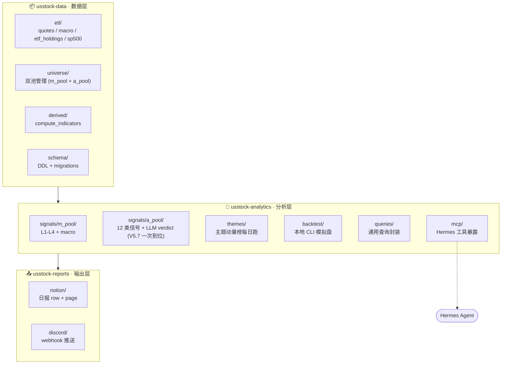

# Codex 任务书 · us-stock-research V5 三层重构

<aside>
🎯

**一次性重构** · V4 → V5 · 三层架构 + 双池显式管理 + 本地开发 → atomic deploy。

**不分支** · trunk 直推 · Codex 写 / 竹蜻蜓审查 / 用户验收 → 部署 LightOS。

**LightOS 现状不动** · 4-29 信号空着 · 等新代码部署后第一次跑自然回填。

</aside>

<aside>
✅

**V5.7 已实装到 origin/master(2026-04-30 实装完成)** · 16 commits + 1 ruff fix + 3 回炉 fix 全部到位 · 竹蜻蜓两轮审查通过。

**Data 包**(commit 3-8 · 6 个): schema 22 表 + universe mcap 锚 + themes 三件套 + etl shares_outstanding + universe sync fail-fast 校验 themes 引用。`pytest 24 passed · ruff All checks passed`。

**Analytics 包**(commit 9-16 + 回炉 · 8 个): m_pool 迁移 + themes score/rank + a_pool calibration / 12 类信号 / 三维评分 / Gemini 2.0 Flash verdict + orchestrator 接 theme history / earnings / corporate_actions 激活 B4/S2b/W1/W2 + mcp 4 工具。`pytest 30 passed · ruff All checks passed`。

**4 处 V5.7 修订全部到位**: ① a_pool.yaml 全 mcap 锚(target_cap 删干净) ② shares_outstanding 周更幂等 ③ themes.yaml 31 主题 + 三表 ④ A 池 12 类信号 + LLM verdict 兜底骨架。

**剩 §13.4 步 17-19**(reports notion/discord + deploy [daily.sh](http://daily.sh))+ **步 20-21**(用户填 a_pool.yaml + review themes.yaml)。

</aside>

## 0. 项目定位

**这是一个简单的个人投资辅助项目** · 写明边界免得后续过度工程。

- **目的**：个人美股波段 + 长线辅助决策 · **不替代**真实交易决策
- **维护人**：1 人 + Codex 写代码 + 竹蜻蜓审查 · 容错下限 = 1 人 30 分钟能看懂全栈
- **三层定位差异（核心理解）**：
    - **数据层** = stand-alone 资产 · 写完封存 · 即便信号系统不用，DB 本身（quotes / macro / fundamentals 完整 5Y 历史）有价值
    - **分析层** = 个人实验场 · 迭代频繁 · experiment 模式 CSV 输出物理隔离（ADR-017）
    - **输出层** = 日报推送 · 半年才动一次 · 不做 dashboard / 不做交互
- **永不做**：实盘 / 多用户 / SaaS / Web UI / 高频 / intraday
- **核心哲学（3 句）**：
    1. smart data, dumb code · 数据齐全则上层简单
    2. 基础设施一次到位 + 算法层可热改
    3. "3 个月后我还有没有动力维护" 是每个新功能的入场考试

## 1. 背景与决策

V4（M0-M3-S1）从云迁本地后暴露三个结构问题：

- 代码散布在 `src/us_stock/jobs/` + `scripts/`，没有清晰边界
- `prepare_quotes` 被 `compute_rows_for_symbols` 和 `compute_indicators` **双重调用**，merge 列名碰撞为 `spy_ret_x` / `spy_ret_y`，4-29 全量 fail（2153/2153）
- `alert_log` / `events_calendar` 两张 side 表迁移夜没建
- 双池（m_pool 大池 / a_pool 小池）虽然 ADR-029/030 已锁，但代码层面没有显式管理接口

V5 决策：

- **三层显式分离** · 数据层 / 分析层 / 输出层 · 每层独立 Python 包 · 独立 entry point · 独立 pytest
- **双池显式管理** · 数据层里有 `universe` 子命令，CLI 形态
- **本地开发** · Codex 在 Windows 仓库写完测好，trunk 直推 · 竹蜻蜓审查 · 部署到 LightOS 走 atomic cutover runbook
- **保留现有 DB** · 1.82M 行 prod 数据不动 · schema 对齐用 ADD COLUMN / CREATE TABLE IF NOT EXISTS · 任何 DROP 必须先备份

## 2. 架构总览



依赖方向单向：**reports 依赖 analytics 依赖 data**。下层不知道上层的存在。

## 3. 包结构

```jsx
us-stock-research/
├── packages/
│   ├── usstock-data/
│   │   ├── pyproject.toml
│   │   ├── src/usstock_data/
│   │   │   ├── __init__.py
│   │   │   ├── etl/
│   │   │   │   ├── quotes_daily.py
│   │   │   │   ├── macro_daily.py
│   │   │   │   ├── etf_holdings.py
│   │   │   │   └── sp500_members.py
│   │   │   ├── universe/
│   │   │   │   ├── m_pool.py        # 自动 curate (ADR-022/023/025) + overrides YAML
│   │   │   │   ├── a_pool.py        # YAML 读写 (config/a_pool.yaml SoT)
│   │   │   │   ├── cli.py           # ⭐ 双池管理 CLI 入口
│   │   │   │   └── sync.py          # 月度 curate (m) + YAML → DB 镜像 (a)
│   │   │   ├── derived/
│   │   │   │   └── compute_indicators.py  # 修复双调用 bug · 加 watermark
│   │   │   ├── schema/
│   │   │   │   ├── ddl.sql          # 完整 schema 声明
│   │   │   │   └── migrate.py       # idempotent migration runner
│   │   │   └── cli.py               # `usstock-data daily` 总入口
│   │   └── tests/
│   ├── usstock-analytics/
│   │   ├── pyproject.toml
│   │   ├── src/usstock_analytics/
│   │   │   ├── signals/
│   │   │   │   ├── m_pool/
│   │   │   │   │   ├── dial.py
│   │   │   │   │   ├── breadth.py
│   │   │   │   │   ├── sector.py
│   │   │   │   │   ├── theme.py
│   │   │   │   │   ├── stock.py
│   │   │   │   │   ├── macro.py
│   │   │   │   │   └── orchestrate.py
│   │   │   │   └── a_pool/          # V5.7 完整实现 · 12 类信号 + 主题加成 + LLM verdict
│   │   │   │       ├── calibration.py    # per-symbol 5Y 历史画像 · 周一 01:00 增量刷
│   │   │   │       ├── signals.py        # 12 类信号 (B1-B5 / S1-S3 / W1-W2 / theme_oversold_entry)
│   │   │   │       ├── scoring.py        # 三维评分 + mcap 反推战略 R:R + 主题加成
│   │   │   │       ├── verdict.py        # Vertex AI Gemini 2.0 Flash · 兜底落规则骨架
│   │   │   │       └── orchestrate.py
│   │   │   ├── themes/                   # 主题动量榜引擎 · 跨池共享
│   │   │   │   ├── score.py              # 每日跑 themes_score_daily
│   │   │   │   └── rank.py               # top/strong/mid/weak/bottom 五分位
│   │   │   ├── backtest/
│   │   │   │   └── cli.py           # python -m usstock_analytics.backtest
│   │   │   ├── queries/             # 共享给 CLI 和 MCP
│   │   │   │   └── core.py
│   │   │   ├── mcp/
│   │   │   │   └── server.py        # 标准 MCP server · 见 §5.4
│   │   │   └── cli.py               # `usstock-analytics signals --date ...`
│   │   └── tests/
│   └── usstock-reports/
│       ├── pyproject.toml
│       ├── src/usstock_reports/
│       │   ├── notion/
│       │   │   ├── row_writer.py
│       │   │   └── page_writer.py
│       │   ├── discord/
│       │   │   └── webhook.py
│       │   ├── formatters/
│       │   │   └── core.py
│       │   └── cli.py               # `usstock-reports daily --date ...`
│       └── tests/
├── config/                         # 保留：CSV 配置（ADR-024 不变）
├── deploy/
│   ├── daily.sh                   # 新版 · 串三层 CLI
│   ├── weekly_backup.sh           # 复用现有
│   └── README.md                  # 部署 runbook
├── pyproject.toml                 # workspace root
└── uv.lock
```

<aside>
⚠️

**Monorepo · 单 repo 三 package** · uv workspace 管理 · 三个 package 各有独立 `pyproject.toml`，根 `pyproject.toml` 用 `[tool.uv.workspace]` 串起来。**不拆三个 git repo**。

</aside>

## 4. 数据层（usstock-data）

### 4.1 ETL 模块

| 模块 | 职责 | 输入 | 输出表 | 来源 |
| --- | --- | --- | --- | --- |
| `etl/macro_daily` | 宏观指标 | FMP / FRED API | `macro_daily` | 迁移自 `src/us_stock/jobs/macro_daily.py` |
| `etl/sp500_members` | S&P 500 成员 | FMP API | `sp500_members_daily` | 迁移自 `sp500_members.py` |

### 4.2 双池管理（重点 · "方便的端口"）

**m_pool 大池**（~2000）

- 来源：自动准入 · ADR-022/023/025
- 装载源优先级：IVV > IJH > IJR > QQQ_intl > Renaissance IPO > hermes 提名 > manual
- 硬过滤：市值 ≥ $1B · 20D 成交 ≥ $10M · ipoDate ≥ 90d · actively_trading
- 维护频率：月度 `usstock-data universe sync --pool m`
- 写入：`symbol_universe.pool='m'` AND `is_active=true`

**a_pool 小池**（~10-20）

<aside>
✅

**语义已敲定 V5.7（2026-04-30）** · A 池 = thesis 跟踪清单 · **辅助出入点判断 · 不存在仓位概念**（不是组合管理 · 没有 weight / target weight）。

**核心字段**：`thesis_stop_mcap_b`（thesis 失效市值 · 单位 B） + `target_mcap_b`（thesis 兑现目标市值 · 3-5y） + `themes[]`（必须 ∈ themes.yaml 已注册 theme_id）。

**为什么用市值不用价**：① 拆股 / 增发免疫（NVDA 10:1 拆股后股价 1000→10 · 市值不变 · thesis 不变）② 基本面方法 DCF / EV/EBITDA 天然出市值 ③ 跨标的可比。

**信号引擎反推**：运行时 `thesis_stop_price = thesis_stop_mcap_b × 1e9 / shares_outstanding` · `target_price = target_mcap_b × 1e9 / shares_outstanding` → 喂 §A.4 战略 R:R 公式。

commit 5 旧 `target_cap` 字段回炉删除 · §4.2.1 是最终 schema · §4.4 DDL 同步。

</aside>

- **SoT(source of truth) = `config/a_pool.yaml`**（本地文件 · schema 见 §4.2.1）· 用户 vim / VSCode 直接编辑 · Hermes 同机 file read · **不再写 Notion**
- 维护方式：直接编辑 YAML OR 跑 `usstock-data universe add/remove --pool a`（CLI 修改 YAML 文件 · 不直接动 DB）
- DB 镜像（最小化 V5.7）：`usstock-data universe sync` 读 YAML → 写 `symbol_universe.pool='a'` + `is_active`（map status） + `thesis_added_at` 三个字段。**不镜像** thesis_stop_mcap_b / target_mcap_b / themes / thesis_summary—信号引擎运行时直接 read YAML（thesis 主观锚点 + 自由文本 + 标签数组放 SQL 反而双写漂移 · ad-hoc 查询走 yaml + 文本工具）
- ADR-024 还原：Notion 是输出-only · **不再有 a_pool 例外**
- **status 语义映射 DB is_active**：`active` / `watching` → `is_active=true` · `removed` → `is_active=false` · 信号引擎永远 `WHERE pool='a' AND is_active=true`

#### 4.2.1 config/a_pool.yaml schema (A 池 SoT · V5.7 final)

```yaml
# A 池长线 thesis 标的 · 本文件是 SoT · git 跟踪 · 改完跑 universe sync
# Hermes 同机 file read · 不走 MCP · DB 不镜像核心字段

- symbol: NVDA                      # 必填 · 大写 ticker
  status: active                    # active(进引擎+打分) | watching(仅记录不打分) | removed
  added: 2025-09-02                 # YYYY-MM-DD · 驱动 §A.3 W2 thesis 时间老化警示

  # ⭐ 战略 R:R 双锚 · 单位 B(十亿美元) · status=active 时必填 · §A.4 战略 R:R 输入端
  thesis_stop_mcap_b: 2000          # thesis 失效市值 · 跌破承认看错(不是技术止损)
  target_mcap_b: 6000               # thesis 兑现目标市值 · 3-5y 视角(不是短期目标)

  thesis_summary: |                 # 必填 · 块标量多行 · 给用户 + LLM verdict 输入用
    AI 算力 capex 周期前段 · 数据中心营收 yoy +200%
    主驱动: 行业 β · 新产品周期
    主风险: 客户集中(Big 4 占 40%)

  # ⭐ 主题标签 · 必须是 config/themes.yaml 已注册 theme_id · 否则 universe sync fail-fast 含行号
  themes: [theme_ai_compute, theme_semiconductor, theme_gpu]

- symbol: AAPL
  status: active
  added: 2025-08-15
  thesis_stop_mcap_b: 2200
  target_mcap_b: 4500
  thesis_summary: |
    Mac/iPad 业务回暖 · Vision Pro 长期可选
    护城河: iOS 生态 + ARM 自研芯片
  themes: [theme_consumer_tech, theme_ar_vr]
```

**字段语义**:

- `thesis_stop_mcap_b` / `target_mcap_b`: 单位**十亿美元(B)** · 浮点 · 不允许 0(0 = 待定 → status 应改 watching 不入引擎 · status=active 强制必填实数)
- 信号引擎反推: `thesis_stop_price = thesis_stop_mcap_b × 1e9 / shares_outstanding` · `target_price = target_mcap_b × 1e9 / shares_outstanding` · 喂 §A.4 战略 R:R = (target_price − close) / (close − thesis_stop_price)
- `themes`: 数组 · 每项必须 ∈ `config/themes.yaml`.keys() · `universe sync` 加载阶段校验 · 未注册主题 fail-fast 含 yaml 行号 + theme_id
- `status` 三态映射 DB `is_active`: active → true · watching → true(但信号引擎 SQL WHERE 加 `status='active'` 过滤) · removed → false

#### 4.2.2 config/m_pool_overrides.yaml schema (M 池强制叠加 · 一般留空)

```yaml
# 在自动 curate 之上叠加 · 多数情况留空
forced_in: []   # 强制加入 m 池: [{symbol: PLTR, reason: "ADR-022 例外"}]
forced_out: []  # 强制踢出 m 池: [{symbol: ABCD, reason: "黑名单"}]
```

**CLI 接口**（`usstock_data.universe` + `usstock_data.themes` · V5.7）

```bash
# 双池通用
usstock-data universe list --pool {m|a|all} [--format table|json|csv]
usstock-data universe show <SYMBOL>      # 跨池详情 · A 池含 mcap 反推后的 thesis_stop_price / target_price
usstock-data universe sync               # 双池同步：m curate + overrides + a YAML 加载 + themes[] 校验

# a_pool 专用（主要推荐直接编辑 YAML · CLI 是辅助）
usstock-data universe add <SYMBOL> --pool a \
    --thesis-stop-mcap <B 数字> \
    --target-mcap <B 数字> \
    --themes <t1,t2,t3> \
    [--summary "<一句 thesis 摘要 · 详细后续 vim 改>"]                          # 追加 entry 到 YAML
usstock-data universe remove <SYMBOL> --pool a [--reason <文本>]                # CLI 改 status: removed
usstock-data universe set-mcap <SYMBOL> --thesis-stop <B> --target <B>          # 改 YAML 双锚
usstock-data universe set-themes <SYMBOL> --themes <t1,t2,t3>                   # 改 themes 数组

# m_pool 专用（自动准入 · 手动调整少见）
usstock-data universe add <SYMBOL> --pool m --source manual
usstock-data universe remove <SYMBOL> --pool m --reason <文本>

# themes 字典（V5.7 新增 · themes.yaml 维护）
usstock-data themes list [--quintile top|strong|mid|weak|bottom]                # 当日主题动量榜
usstock-data themes show <THEME_ID>                                              # 主题详情 + 成员 + 历史 RS
usstock-data themes validate                                                      # 校验 a_pool.yaml 所有 themes 引用
usstock-data themes sync                                                          # themes.yaml → themes_master / themes_members
```

所有变更自动写入 `symbol_universe_changes` 表（已存在），保留审计轨迹。

### 4.3 派生数据

**`derived/compute_indicators`** · 必修内容：

1. **修复 `prepare_quotes` 双调用 bug** · 加 idempotent guard：函数开头先 `drop` 已存在的 `stock_ret` / `spy_ret` 列
2. **加 watermark 跳过逻辑** · 已经在 `daily_indicators` 里有 trade_date 的 symbol，跳过 fetch
3. **失败可观测** · 把 `Skipping X: 'spy_ret'` 这种 swallow 改成 `logger.exception` 带完整 traceback
4. **alert_log 写入容错** · 表不存在不抛错（已有逻辑）

### 4.4 Schema migrations

`schema/ddl.sql` 必须 idempotent · 包含全部 13 张现有表 + 2 张缺失表的 `CREATE TABLE IF NOT EXISTS`。重点：

```sql
-- 新增 · 缺失表
CREATE TABLE IF NOT EXISTS alert_log (
  id BIGSERIAL PRIMARY KEY,
  job_name TEXT NOT NULL,
  symbol TEXT,
  trade_date DATE,
  severity TEXT NOT NULL CHECK (severity IN ('INFO','WARN','ERROR')),
  message TEXT,
  created_at TIMESTAMPTZ NOT NULL DEFAULT now()
);
CREATE INDEX IF NOT EXISTS idx_alert_log_date ON alert_log(trade_date);

CREATE TABLE IF NOT EXISTS events_calendar (
  symbol TEXT NOT NULL,
  event_date DATE NOT NULL,
  event_type TEXT NOT NULL,
  details JSONB,
  PRIMARY KEY (symbol, event_date, event_type)
);

-- 新增 · symbol_universe.pool 列 + a 池最小镜像 + mcap 反推字段（V5.7）
ALTER TABLE symbol_universe ADD COLUMN IF NOT EXISTS pool TEXT NOT NULL DEFAULT 'm' CHECK (pool IN ('m','a'));
ALTER TABLE symbol_universe ADD COLUMN IF NOT EXISTS thesis_added_at TIMESTAMPTZ;             -- a 池加入时间 (YAML mirror)
ALTER TABLE symbol_universe ADD COLUMN IF NOT EXISTS shares_outstanding NUMERIC;               -- 流通股数 · A 池 mcap → price 反推必备
ALTER TABLE symbol_universe ADD COLUMN IF NOT EXISTS shares_outstanding_updated_at TIMESTAMPTZ;
-- ⚠️ V5.7 删除：旧的 target_cap NUMERIC 字段（commit 5 已实现 · 回炉拉掉）
-- 注: thesis_stop_mcap_b / target_mcap_b / themes / thesis_summary 不入 DB · 全在 config/a_pool.yaml
-- m_pool 是默认 · 现有数据迁移到 'm' · a_pool 通过 universe sync 标记
CREATE INDEX IF NOT EXISTS idx_symbol_universe_pool ON symbol_universe(pool);

-- 新增 · 主题字典三表（V5.7 · M 池主题层 + A 池主题加成共享 SoT）
CREATE TABLE IF NOT EXISTS themes_master (
  theme_id TEXT PRIMARY KEY,                     -- snake_case · 例: theme_ai_compute
  name TEXT NOT NULL,                            -- 显示名 · 例: AI 算力
  description TEXT,
  category TEXT,                                 -- tech / energy / health / ...
  representative_etf TEXT,                       -- 代表 ETF · 例: SMH(半导体) / BOTZ(机器人 AI)
  created_at TIMESTAMPTZ NOT NULL DEFAULT now(),
  updated_at TIMESTAMPTZ
);

CREATE TABLE IF NOT EXISTS themes_members (
  theme_id TEXT NOT NULL REFERENCES themes_master(theme_id) ON DELETE CASCADE,
  symbol TEXT NOT NULL,
  segment TEXT NOT NULL CHECK (segment IN ('core','diffusion','concept')),  -- §6.2 三段篮子
  added_at TIMESTAMPTZ NOT NULL DEFAULT now(),
  PRIMARY KEY (theme_id, symbol)
);
CREATE INDEX IF NOT EXISTS idx_themes_members_symbol ON themes_members(symbol);

CREATE TABLE IF NOT EXISTS themes_score_daily (
  trade_date DATE NOT NULL,
  theme_id TEXT NOT NULL REFERENCES themes_master(theme_id),
  rs_median NUMERIC,                             -- 成员核心股 RS(20D) 中位数
  rs_etf NUMERIC,                                -- 代表 ETF RSI（辅助）
  momentum_score NUMERIC,                        -- 复合分 0-100
  rank INTEGER,                                  -- 当日横截面排名
  quintile TEXT CHECK (quintile IN ('top','strong','mid','weak','bottom')),
  PRIMARY KEY (trade_date, theme_id)
);
CREATE INDEX IF NOT EXISTS idx_themes_score_date ON themes_score_daily(trade_date);
CREATE INDEX IF NOT EXISTS idx_themes_score_quintile ON themes_score_daily(trade_date, quintile);
```

<aside>
⚠️

⚠️ Codex **不得**对 13 张现有表做 DROP / 数据破坏性 ALTER。所有结构变更必须 ADD COLUMN IF NOT EXISTS / CREATE INDEX IF NOT EXISTS / CREATE TABLE IF NOT EXISTS。审计：跑 migrate 前 `pg_dump --schema-only` 对比前后差异。

</aside>

### 4.5 总入口

```bash
usstock-data daily [--as-of YYYY-MM-DD]
# 内部串行：quotes → macro → universe sync (m_pool 增量) → compute_indicators
# --as-of 默认 = 最新 quotes_daily.trade_date
```

### 4.6 为回测齐全 · 数据层最终扩展（基于核心逻辑反推）

读完 [核心逻辑](https://www.notion.so/b0234e466f1e407996a938c1e3d5a24a?pvs=21) 后，数据层在 V4 缺 **3 张回测必备表 + 2 个字段对齐**。本节一次性补齐，**无第二次返工**。

#### 4.6.1 corporate_actions（splits + dividends 历史）

**为什么必需**：§12.2 模拟盘 NAV 还原真实总收益 + §A.2 5Y 历史画像。Splits 还会污染技术指标（200MA 跨拆股日断裂）。

```sql
CREATE TABLE IF NOT EXISTS corporate_actions (
  symbol TEXT NOT NULL,
  ex_date DATE NOT NULL,
  action_type TEXT NOT NULL CHECK (action_type IN ('split','dividend','spinoff')),
  ratio FLOAT,                -- splits: ratio = new_shares / old_shares · 4-for-1 = 4 · 反向 1-for-10 = 0.1 · 永远正数 · new_price = old_price / ratio
  cash_amount FLOAT,          -- dividends: 每股美元
  details JSONB,
  PRIMARY KEY (symbol, ex_date, action_type)
);
CREATE INDEX IF NOT EXISTS idx_corp_actions_date ON corporate_actions(ex_date);
```

数据源：FMP `historical-price-full/stock_split` + `historical-price-full/stock_dividend`。

#### 4.6.2 fundamentals_quarterly（季报 EPS / Revenue / 关键科目）

**为什么必需**：§7.2 个股综合分 = 技术 60% + **基本面 25%** + 主题 15%。V4 占位简化，V5 一次补到位。

```sql
CREATE TABLE IF NOT EXISTS fundamentals_quarterly (
  symbol TEXT NOT NULL,
  period_end DATE NOT NULL,
  fiscal_period TEXT NOT NULL,    -- 'Q1' | 'Q2' | 'Q3' | 'Q4'
  reported_at TIMESTAMPTZ,        -- 实际公告时间
  revenue FLOAT,
  eps_actual FLOAT,
  eps_estimate FLOAT,
  net_income FLOAT,
  operating_cash_flow FLOAT,
  free_cash_flow FLOAT,
  guidance JSONB,                 -- 公司给的下季/年度预期
  PRIMARY KEY (symbol, period_end)
);
CREATE INDEX IF NOT EXISTS idx_fund_q_reported ON fundamentals_quarterly(reported_at);
```

数据源：FMP `income-statement` + `cash-flow-statement` + `earnings-surprises`（quarter limit=20）。

#### 4.6.3 events_calendar（双源喂料）

表结构见 §4.4。**两个上游**：

- 财报日期 → FMP `earning_calendar` endpoint（未来 90 天滚动）
- 拆股 + 分红 → `corporate_actions` 派生（每行 INSERT 时同步 INSERT 一行 events_calendar）

#### 4.6.4 quotes_daily 加 asset_class 字段（BTC 简方案）

**为什么必需**：§11.3 风险偏好端要 BTC。**不**单独建 crypto_daily 表（克制原则），加字段最简：

```sql
ALTER TABLE quotes_daily ADD COLUMN IF NOT EXISTS asset_class TEXT NOT NULL DEFAULT 'equity' CHECK (asset_class IN ('equity','crypto'));
CREATE INDEX IF NOT EXISTS idx_quotes_asset_class ON quotes_daily(asset_class);
```

BTC / ETH 等 crypto symbol 标 `'crypto'`，equity 不动。

#### 4.6.5 macro_daily 字段对齐

§11.3 三端 + §11.4 辅助需要 `macro_daily` 含以下字段（**lowercase snake_case 锁死命名 · Codex 不要自由发挥**）：

```sql
-- 已有 · 不动
trade_date DATE PRIMARY KEY
vix FLOAT

-- V5 锁定字段（缺啥 ALTER ADD COLUMN IF NOT EXISTS）
dgs10 FLOAT              -- 10年期国债收益率（FRED DGS10）
dgs2 FLOAT               -- 2年期国债收益率（FRED DGS2）
ten_minus_two FLOAT      -- 派生 = dgs10 - dgs2
dxy FLOAT                -- 美元指数
wti FLOAT                -- WTI 原油
ief_close FLOAT          -- 中期国债 ETF 收盘
hyg_lqd_spread FLOAT     -- 高收益债 / 投资级债 利差
gold_silver_ratio FLOAT  -- 金银比
```

Codex 第一步：`\d macro_daily` 看现状 · 缺啥 ALTER ADD COLUMN IF NOT EXISTS · **不重拉历史**（保留现有 1830 行）· 缺的字段从今日往前回填即可。

#### 4.6.6 ETL 新增 3 个 Fetcher 子项

| 模块 | 职责 | 输出 | 频次 | `etl/corporate_actions` | FMP 拉 splits + dividends | `corporate_actions`  • 派生写 `events_calendar` | 每日（轻量） |
| --- | --- | --- | --- | --- | --- | --- | --- |
| `etl/fundamentals` | FMP 拉财报关键科目 + earnings surprises | `fundamentals_quarterly` | 每日（检测新公告） | `etl/earnings_calendar` | FMP 拉未来 90 天财报日期 | `events_calendar` 财报段 | 每日 |

`usstock-data daily` 总入口顺序更新（V5.7）：

```jsx
quotes → macro → corporate_actions → fundamentals → earnings_calendar
        → shares_outstanding （周更 · cache 7d）
        → universe sync （校验 a_pool.yaml themes 引用）
        → compute_indicators → themes_score_daily （主题动量榜）
```

#### 4.6.6.a 新增 ETL：shares_outstanding 拉取（V5.7）

**为什么必需**：A 池 mcap → price 反推必备 · §A.4 战略 R:R 输入端。

- 数据源：Polygon `/v3/reference/tickers/{symbol}` 字段 `weighted_shares_outstanding`（亦可 FMP `key-metrics` `sharesOutstanding`）
- 频次：周更 · `shares_outstanding_updated_at < now() - 7d` 的 active symbol 才拉（增发 / 拆股不频繁）
- 写入：`symbol_universe.shares_outstanding` + `shares_outstanding_updated_at`
- 失败容错：单 symbol fail 写 alert_log · 不阻塞 daily

#### 4.6.6.b 新增 ETL：themes.yaml 反推 + themes_master/members 同步（V5.7）

**ADR-028 落地** · Codex 一次性产出 themes.yaml 第一版：

- 输入：`config/etf_universe.csv` 中 `algo_role=L3_theme` 的 ~35 个主题 ETF + `etf_holdings_latest`
- 脚本：`scripts/generate_themes_from_etf.py`（本地一次性跑 · 不进 daily）
- 输出：`config/themes.yaml` 草案 → 用户 review → PR merge
- 同步：`usstock-data themes sync` 读 yaml → upsert `themes_master` + `themes_members`
- 校验：`usstock-data themes validate` 检查 a_pool.yaml 每个 themes[] 都注册 · 未注册 fail-fast

#### 4.6.6.c themes_score_daily 主题动量榜引擎（V5.7）

- 数据层只写表 schema · 分析层负责跑分 · 见 §5.2.5
- 输出 quintile（top / strong / mid / weak / bottom）
- 消费方：M 池 §6.3 主题状态机 + A 池主题加成 + 第 12 类信号 `theme_oversold_entry`

#### 4.6.7 不补的（克制原则 · 写明理由免得 Codex 自作主张加）

| 候选 | 不补理由 |
| --- | --- |
| `~~a_pool_calibration` / `signals_a_pool_daily`（2 表）~~ | **V5.7 改为本次一并建** · §A 全节一次到位 · 不分两阶段 · 表 schema 见 §4.6.9 |
| `nav_daily` / `positions_current` / `trades_log` / `stage_entries`（模拟盘四件套） | backtester 输出走 CSV 到 `bt_reports/`，不入 prod 表（保持 ADR-017 信号-模拟物理隔离） |
| 独立 `fetch_errors` 表 | 跟 `alert_log` 合并，`job_name='fetch_*'` 区分 · 表数量 -1 |

#### 4.6.8 数据层最终表清单（V5.7）

本任务结束时 LightOS DB 应有 **22 张表**：

- 现有 13 张（不动）
- 新建 4 张：`alert_log` / `events_calendar` / `corporate_actions` / `fundamentals_quarterly`
- 新建 3 张主题字典（V5.7）：`themes_master` / `themes_members` / `themes_score_daily`
- 新建 2 张 A 池（V5.7）：`a_pool_calibration`（per-symbol 5Y 画像 周更） / `signals_a_pool_daily`（12 类信号日产出）

字段补丁：

- `symbol_universe`：+ `pool` + `thesis_added_at` + `shares_outstanding` + `shares_outstanding_updated_at`
- `symbol_universe`：⚠️ V5.7 删除旧的 `target_cap`（commit 5 回炉）
- `quotes_daily`：+ `asset_class`（equity / crypto）
- `macro_daily`：按需 ADD 字段（详 §4.6.5）

#### 4.6.9 A 池新增 2 表（V5.7 一次到位）

**a_pool_calibration**（per-symbol 5Y 历史画像 · 周一 01:00 增量刷 · §A.2）列名：symbol（PK） / computed_at / typical_pullback / deep_pullback（90 分位） / extreme_pullback（95-99 分位） / strong_supports JSONB / rsi_p5 / rsi_p95 / typical_uptrend_length / typical_uptrend_gain / beta_5y_mean / beta_5y_std。

**signals_a_pool_daily**（每日 12 类信号 + 评分 + 出入点 + verdict）列名：PK（trade_date, symbol） / signals JSONB（B1-B5/S1-S3/W1-W2/theme_oversold_entry 命中数组） / elasticity_score（35%） / value_score（30%） / rr_score（35%） / a_score / strategic_rr / tactical_rr / entry_aggressive / entry_moderate（= typical_pullback） / entry_conservative（= deep_pullback） / stop_shallow（= strong_support_1） / stop_deep（= strong_support_2） / short_target（= 60D 高点 / typical_uptrend_gain） / theme_quintile（top/bottom/null） / theme_bonus / verdict_text。

索引：`signals_a_pool_daily(trade_date)` + `signals_a_pool_daily(trade_date, a_score DESC)`。Codex 写 ddl.sql 时遵循 §4.4 那套语义 + IF NOT EXISTS 幂等约束。

---

## 5. 分析层（usstock-analytics）

### 5.1 M 池信号引擎

直接迁移 V4.0.12 已合的 5 模块（dial / breadth / sector / theme / stock）+ orchestrate。**算法不动**，只调路径和 import。

### 5.2 A 池信号引擎（V5.7 一次到位 · 12 类信号 + 三维评分 + LLM verdict）

ADR-030 实现 · 原 11 类扩充为 12 类（新增 `theme_oversold_entry` 低吸埋伏）。模块拆分：

#### 5.2.1 [calibration.py](http://calibration.py)【per-symbol 5Y 历史画像】

- 频次：周一 01:00 增量刷 · 拉 active 标的近 5Y `quotes_daily` + `daily_indicators`
- 输出 `a_pool_calibration` 表全字段：typical/deep/extreme_pullback、strong_supports（K-means 聚 3-5 点）、个性化 rsi_p5/p95、typical_uptrend_length/gain、beta_5y_mean/std
- 拆股复权：调 `corporate_actions` 调整历史价 · 200MA 不被拆股日污染

#### 5.2.2 [signals.py](http://signals.py)【12 类信号】

**B 类入场 5：**

- B1 回踩：pullback_pct ∈ [typical_pullback ± 20%] 且 close > 200MA
- B2 突破：close 创 60D 高 且 vol > 1.5× 20D 均量
- B3 超卖：rsi14 < rsi_p5（个性化 · 不用通用 30）
- B4 金叉：macd 金叉 且 距一次金叉 ≥ 60D
- B5 强支撑反弹：close 距某个 strong_supports[i] < 1% 且收阳

**S 类出场 4（S2 拆 a/b）：**

- S1 跌破支撑：close < strong_supports[最近] 且跌幅 > 2%
- S2a 死叉快：MA20 下穿 MA50
- S2b 死叉慢：MA50 下穿 MA200
- S3 量价背离：60D 创高但 RSI 背离 且 vol 趋减

**W 类警示 2：**

- W1 过热：rsi14 > rsi_p95 连续 3D
- W2 thesis 时间老化：now() - added > 3y 且 close < target_price×0.5

**主题类 1（V5.7 新增第 12 类）：**

- `theme_oversold_entry`：symbol 所在 themes[] 有 ≥ 1 个命中 `themes_score_daily.quintile='bottom'` 且该主题 4W 内连续底部（心愿头头） 且 close > thesis_stop_price × 1.3（距 thesis 死门预留 ≥ 30%） 且 近 1W 命中 B5 强支撑

#### 5.2.3 [scoring.py](http://scoring.py)【三维评分 + mcap 反推 + 主题加成】

- 弹性分 35%：beta_5y_mean · typical_uptrend_gain 加权
- 性价比分 30%：基于战术 R:R = (short_target − close) / (close − stop_shallow)
- R:R 分 35%：基于战略 R:R = (target_price − close) / (close − thesis_stop_price)·其中 target_price/thesis_stop_price 由 mcap 反推：price = mcap_b × 1e9 / shares_outstanding · shares_outstanding NULL 走 hold + 写 alert_log WARN
- 三维加权 → a_score ∈ [0,100]
- 主题加成：命中 theme_quintile='top' → +5 · 'bottom'+第 12 类触发 → +3 · 其它 0
- 出入点：entry_aggressive/moderate/conservative + stop_shallow/deep + short_target 全部在 calibration 画像上取

#### 5.2.4 [verdict.py](http://verdict.py)【Vertex AI Gemini 2.0 Flash LLM 润色】

- 输入：a_score + signals[] + entry/stop/target + thesis_summary + theme_quintile
- 输出：verdict_text（一句话 · 中文 · 口语化）
- API：Vertex AI gemini-2.0-flash-001 · us-central1 · max_output_tokens=200 · temperature=0.3
- 兜底：LLM 失败 / 超时（>3s） → 落规则骨架 `"【{symbol}】A_Score={score} · {top_signal} · 入场 {entry_moderate} / 止损 {stop_shallow}"`
- 预算：·¤0.3/年（10 标的 × 250 交易日 × ·¤ 1e-4/调用）

#### 5.2.5 主题动量榜引擎（`themes/score.py` + `themes/rank.py` · 跨池共享）

- 输入：`themes_members`（segment='core' 取出成员股） + `daily_indicators.rs_20d` + 代表 ETF RSI
- 计算：`momentum_score = 0.7 × rs_median + 0.3 × rs_etf`·全主题横截面排名 → quintile（top/strong/mid/weak/bottom）
- 输出 `themes_score_daily`·调用点：`usstock-data daily` 末尾章 · compute_indicators 之后
- 消费方：M 池 §6.3 主题状态机 + A 池 §5.2.3 主题加成 + A 池 §5.2.2 第 12 类信号 三处共用
- 干售：`themes_score_daily` 是现产现耗 · 不向后填· 某主题某日缺分 → 该日需该主题信号打不出（走 hold）

#### 5.2.6 [orchestrate.py](http://orchestrate.py)【串起全流程】

```python
calibration_due() → refresh_calibration()  # 周一才跑
for symbol in a_pool_active_symbols:
    sigs = run_signals(symbol, date)
    score = scoring(symbol, sigs, calibration[symbol], theme_score)
    verdict = llm_verdict(score, sigs)
    upsert signals_a_pool_daily
```

### 5.3 Backtest（模拟盘）

ADR-033 锁定本地 CLI · 不上云端：

```bash
usstock-analytics backtest --start 2025-01-01 --end 2026-04-29 [--params <json>]
# 输出 → bt_reports/<run_id>.csv（本地）
```

### 5.4 MCP Server（不只给 Hermes · 砸至 4 工具 · a 池 thesis 走文件不走 MCP）

**返回值原则**：MCP 工具返回必须是 **raw structured data**（dict / list / numbers），**不**做 LLM-friendly 的 narrative 包装。Narrative 让 client 自己生成。这样 jupyter / 用户自写脚本 / 其他 LLM / Hermes 都能直接用，避免 "Hermes 专用" 耦合。MCP 本质是查询面标准化，不是为某个具体 client 定制。

**克制原则**：暴露的查询面 5 个，覆盖 95% 用例 · 余下 client 直接走 SQL：

| 工具名 | 参数 | 返回 | 用途 |
| --- | --- | --- | --- |
| `get_dial` | `date` | dial 档位 + VIX + breadth 概况 | 当日大盘 |
| `get_top_themes` | `date`, `n=3` | ETF Top N + 综合分 | 主题层 |
| `get_top_stocks` | `date`, `n=5`, `pool='m\|a'` | 个股 Top N + 触发链 | 个股操作 |
| `query_signals` | `date_range`, `filter` | 信号行 | 历史回查 |

**砸掉**：`get_breadth`（合并到 `get_dial` 返回里）· `list_alerts`（让 Hermes 直接 SQL 查 alert_log）· `get_a_pool_thesis`（Hermes 同机 `read config/a_pool.yaml` · 不需 MCP 包装 · 工具数 -3）。

Hermes 端通过 `mcpServer` 配置接入 · 本任务**只交付 server 起得来**，Hermes 实际接入留单独 session。

### 5.5 总入口

```bash
usstock-analytics signals --date YYYY-MM-DD [--pool m|a|all]
# 输入：daily_indicators + macro_daily + symbol_universe
# 输出：signals_daily / signals_alerts / signals_sectors_daily / signals_themes_daily / signals_stocks_daily
```

## 6. 输出层（usstock-reports）

### 6.1 Notion 日报

双层持久化（ADR-021）：

- **row properties** 写 [](https://www.notion.so/b12ec9cc6114438d9651db6e6daf2c40?pvs=21)
- **page body** markdown 完整版 · 含 dial / breadth / sector / theme / stock / macro 六段
- **不含 NAV 段**（ADR-033 删除模拟盘部分）

### 6.2 Discord 推送

精简版手机速览：

- 一行 dial（S/A/B/C/D + 仓位映射）
- ETF Top 3
- 个股 Top 5（M 池）+ A 池信号 highlights（如有）
- 关键告警（如有）

### 6.3 总入口

```bash
usstock-reports daily --date YYYY-MM-DD [--no-notion] [--no-discord]
# 输入：signals_* 五张表（不读 daily_indicators / quotes_daily）
# 输出：Notion row + page · Discord webhook
```

## 7. DB schema 对齐表

| 表 | 当前 | V5 操作 | 风险 | `symbol_universe` | ✅ | ADD COLUMN pool | 低 · 默认 'm' |
| --- | --- | --- | --- | --- | --- | --- | --- |
| `symbol_universe_changes` | ✅ | 不动 | 无 | `watchlist` | ✅ | 对齐 ADR-029 字段（如有缺） | 低 |
| `quotes_daily` | ✅ 1.82M 行 | 不动 | 无 | `macro_daily` | ✅ 1830 行 | 不动 | 无 |
| `daily_indicators` | ✅ 450K 行 | 不动 | 无 | `etf_holdings_latest` | ✅ | 不动 | 无 |
| `sp500_members_daily` | ✅ | 不动 | 无 | `signals_daily` | ✅ | 不动 | 无 |
| `signals_alerts` | ✅ | 不动 | 无 | `signals_sectors_daily` | ✅ | 不动 | 无 |
| `signals_themes_daily` | ✅ | 不动 | 无 | `signals_stocks_daily` | ✅ | 不动 | 无 |
| `alert_log` | ❌ | CREATE | 无 | `events_calendar` | ❌ | CREATE | 无 |

## 8. 部署 runbook

### 8.1 本地开发（Codex · Windows）

```bash
git clone <repo>
cd us-stock-research
uv sync
# 起本地 postgres 17（docker · 端口 5433 避开 LightOS 的 5432）
docker run -d --name pg17-dev -e POSTGRES_PASSWORD=devpass -p 5433:5432 postgres:17
# 灌一份 LightOS dump 当 fixture（任选一周）
python -m usstock_data.schema.migrate
pytest packages/  # 三层独立 unit + e2e
```

### 8.2 测试矩阵（最小集）

| 层 | 关键测试 | data | universe add/remove/list/sync 4 个 · compute_indicators idempotent · prepare_quotes 双调用反例 · migration 跑两遍幂等 |
| --- | --- | --- | --- |
| analytics | 5 模块单测保留 · orchestrate e2e 用 1 周 fixture · MCP server 起得来 + tools list | reports | Notion 写入 mock · Discord webhook mock · formatter 输出 snapshot |

### 8.3 部署到 LightOS（atomic cutover）

```bash
# 🐧 LightOS · 一次性切换 · 操作前 manual backup
ssh -p 2222 naivedog@<host>
cd ~/us-stock-research

# 1. 备份现状
~/scripts/weekly_backup.sh

# 2. 拉新代码
git pull
uv sync

# 3. 跑 schema migration（idempotent · 安全）
uv run python -m usstock_data.schema.migrate

# 4. universe 初始化（现有 symbol_universe 全标 'm' · 从 config/a_pool.yaml 加载 a_pool）
# 前置：用户已在 Codex 交付的 repo 里填好 config/a_pool.yaml（从 旧 Notion 长线池迁移过来）
uv run python -m usstock_data.universe sync
uv run python -m usstock_data.universe list --pool a  # 验证 a 池加载了

# 5. 回填 4-29
uv run python -m usstock_data daily --as-of 2026-04-29
uv run python -m usstock_analytics signals --date 2026-04-29
uv run python -m usstock_reports daily --date 2026-04-29 --no-discord
# (--no-discord 是因为旧 webhook 已暴露 · 等 secrets 轮换后开)

# 6. 替换 daily.sh
cp deploy/daily.sh ~/scripts/daily.sh
chmod +x ~/scripts/daily.sh

# 7. 等 5/5 周二 06:30 cron 自然跑
```

### 8.4 回滚

```bash
git revert HEAD
git push
ssh ... && cd ~/us-stock-research && git pull
# DB 数据不会丢（migration 是 ADD-only）
# 只是回到旧 daily.sh + 旧代码路径
```

## 9. 验收标准（V5.7）

- [ ]  三个 package 独立 `pytest` 全绿
- [ ]  `usstock-data universe` 7 个 CLI：list / show / sync / add / remove / set-mcap / set-themes
- [ ]  `usstock-data themes` 4 个 CLI：list / show / validate / sync
- [ ]  `usstock-data daily --as-of 2026-04-29` 跑出 indicators ≈ 2145 行（修复 spy_ret bug）
- [ ]  `usstock-data daily` 末尾产出 `themes_score_daily` · 五分位 quintile 平均分布
- [ ]  `usstock-analytics signals --date 2026-04-29 --pool a` 跑出 `signals_a_pool_daily` · 12 类信号都有命中例·verdict_text 非空
- [ ]  **LLM verdict 实测**：随机抽 1 个 a_score 高的标的 · verdict_text 中文口语化 · 包含三要素（信号 + 入场价 + 止损价）
- [ ]  **LLM 兜底测**：Vertex AI key 临时赋空 · 上述 CLI 不报错 · verdict_text 落规则骨架格式
- [ ]  `usstock-analytics signals --date ... --pool m` 跑出 5 张 M 池 signals 表完整
- [ ]  `usstock-reports daily --date 2026-04-29 --no-discord` 写入 Notion 日报 row + page (A 池 highlights 区块能出)
- [ ]  `alert_log` / `events_calendar` / `corporate_actions` / `fundamentals_quarterly` / `themes_master` / `themes_members` / `themes_score_daily` / `a_pool_calibration` / `signals_a_pool_daily` 在 LightOS 已建 = 9 张新表 (总 22 张)
- [ ]  `symbol_universe`：+pool / +thesis_added_at / +shares_outstanding / +shares_outstanding_updated_at · 并删除旧 target_cap (验证: `\d symbol_universe` 不含 target_cap)
- [ ]  m/a 两池行数符合预期（m ~2000 / a ~5-20）
- [ ]  `themes themes validate` 实测：故意改 a_pool.yaml 某 themes 为未注册 · `universe sync` fail-fast · 错误含 yaml 行号
- [ ]  MCP server 能起来，`mcp inspector` 看到 4 个工具
- [ ]  LightOS 现有 13 张表 1.82M+ 行数据无损（pg_dump 前后对比）
- [ ]  新 [daily.sh](http://daily.sh) 在 dry-run 模式下跑通
- [ ]  周日 weekly_backup 仍正常
- [ ]  用户填完 `config/a_pool.yaml` 5 个初始标的 + Codex 交付 `config/themes.yaml` 草案

## 10. 不在本任务范围（V5+1）

- ~~A 池信号引擎 11 类信号 + LLM verdict（ADR-030）· 单独 PR~~ ⚠️ **V5.7 已并入本次**（2026-04-30 用户拍板）· 12 类信号 + Vertex AI verdict 全部进 V5
- Hermes 实际接 MCP（独立 session · Hermes 仓库改）
- 节假日哨兵（cron 跑空数据问题）
- secrets 轮换（FMP / Discord / Notion）· 用户手动
- GCP 实例彻底删除（5/7 后）
- Git 默认分支 `master` → `main`（GitHub 设置 + 本地 + LightOS 三处同步 · 与 V5 重构无冲突）
- 删除 [](https://www.notion.so/acb0b255958b4fceba4cca3f059afa90?pvs=21)（待 `config/a_pool.yaml` 迁移完成 + V5 部署后 · 由用户确认 · 竹蜓蛓执行）

## 11. 协作约定

- **不分支** · trunk 直推 · commit message 用 `feat:` / `fix:` / `chore:` 前缀
- **Codex 写完一个 package 就 push 一次** · 不等三个全做完一次性 push（便于审查）
- **YAML 双池错误处理** · `config/a_pool.yaml` 语法错误 · `universe sync` 必须 fail-fast（不静默跳过）· 错误信息含行号 · 避免同步出一个空 a 池
- **竹蜻蜓审查重点** · 对照本任务书每节验收 · 重点查 schema 对齐 + 双调用 bug 修复 + universe CLI 行为
- **用户角色** · 验收 + 发部署指令 · 不直接改代码

## 12. 维护原则（防过度工程 · 个人项目特别条款）

### 12.1 新功能入场考试

每加一个表 / 模块 / MCP 工具 / 新依赖之前，必须答：**"3 个月后我还有没有动力维护这个？"** 答不出来就不加。

### 12.2 基础设施一次到位 + 算法层可热改

- **data 层 + reports 层**：写完封存 · 半年至季度才动一次 · 不要在这里反复返工
- **analytics 层**：设计用来频繁迭代的实验场 · 算法改动走 trunk 直推 + experiment 模式（CSV 输出）兜底 · 不污染 prod 表（ADR-017）
- **不要把 data / reports 当实验场** — 会拖慢迭代且数据基础动摇

### 12.3 过度工程警戒线（任一触发就停下来想想）

- 单 package > 30 个 .py 文件 → 该拆了？还是该删了？
- 单模块 > 500 行 → 真的需要这么多逻辑？
- 配置 / params 拆超过 3 处 → 集中到 `config/params.yaml`
- V5+N 加新表前没有先想 "能不能复用现有表" → 必须先想

### 12.4 退出友好

维护中断时（出差 / 失去兴趣 / 换方向）：

- 数据层不会坏 · DB 是 standalone 资产 · 5Y quotes / macro / fundamentals 历史本身值钱
- cron 失败有 alert_log 兜底 · 不会 silent fail
- 周日 weekly_backup 自动跑 · 数据不会丢

### 12.5 V5+N 不做的清单（防 scope creep）

明确写清楚 V5+1 之外**永不做**的范围（与 §0 重复但更具体）：

- 实盘交易桥接（IBKR / Alpaca / 富途）
- Web Dashboard / 移动 App
- 多用户 / 多账户
- SaaS 化 / 收费
- 高频信号 / intraday
- LLM 对 LLM 的 agent 自动决策（人在闭环里）

## 13. 工作起点 / 改造范围（Codex 必读）

**起点**：现有 `us-stock-research` repo trunk · **不**新建 repo · **不**开分支。这是重构（refactor）不是重写（rewrite）· 算法逻辑从 V4.0.12 git history 迁过来 · DB 完全不动。

### 13.1 先删（一次性 commit · message: `chore: clean V4 layout`）

- `src/us_stock/`（整个目录删）
- `scripts/*.py`（compute_[indicators.py](http://indicators.py) / reconcile_[indicators.py](http://indicators.py) / fetch_*.py 等所有 .py · 功能迁到 `packages/*/[cli.py](http://cli.py)`）
- 根 `pyproject.toml`（旧 setuptools 配置 · 会被 uv workspace root 替换）
- `requirements*.txt` / `setup.py` / `setup.cfg`（如有）
- `tests/`（旧测试 · 新测试随各 package 一起写）

### 13.2 保留

- `.git/` / `.gitignore` / `README.md`（内容后续更新）
- `config/`（CSV 装载源 · ADR-024 不变 · **新增 `a_pool.yaml` + `m_pool_overrides.yaml` 见 §13.3**）
- `scripts/daily.sh` / `scripts/weekly_backup.sh` → 移到 `deploy/`（内容重写）
- `.env.example`（如有）
- **DB 完全不动** · schema 迁移走 §8 atomic cutover · 不在本步

### 13.3 新建

- `pyproject.toml`（uv workspace root · `[tool.uv.workspace] members = ["packages/*"]`）
- `packages/usstock-data/` / `packages/usstock-analytics/` / `packages/usstock-reports/`（骨架见 §3）
- `deploy/daily.sh`（新版 · 串三层 CLI · 见 §8.3）
- `deploy/README.md`（部署 runbook）
- `uv.lock`（`uv sync` 自动生成）
- `config/a_pool.yaml`（A 池 SoT · schema 见 §4.2.1 · 用户从 [](https://www.notion.so/acb0b255958b4fceba4cca3f059afa90?pvs=21) 迁移 thesis 到此文件后再删 Notion 页）
- `config/m_pool_overrides.yaml`（M 池强制叠加 · schema 见 §4.2.2 · 初始 `forced_in: []` + `forced_out: []`）

### 13.4 commit / push 节奏（V5.7 · 21 步 · 便于审查）

<aside>
🚁

**进度 2026-04-30 13:52** · 步 1-16 全部到 `origin/master`(`5416f78..95ad42d`) · data 24 测试 + analytics 30 测试 + ruff 全绿 · 竹蜻蜓两轮审查通过(P0 themes 字典 fail-fast + P1 orchestrator 接 theme_history/earnings/corporate_actions 激活 B4/S2b/W1/W2 + P1 现产现耗 docstring 全部回炉补完)。剩 17-19(reports + deploy) + 20-21(用户手动)。

</aside>

```jsx
✅ 1. chore: clean V4 layout                          ← 删旧代码 (已完成)
✅ 2. chore: scaffold uv workspace + 3 packages       ← 空骨架 (已完成)
🔁 3. feat(data): schema/ddl + migrate runner         ← 22 表 idempotent (回炉: 17→22 · 加 themes_master/members/score_daily/a_pool_calibration/signals_a_pool_daily)
✅ 4. feat(data): etl 7 子项（quotes/macro/sp500/etf_holdings/corp_actions/fundamentals/earnings_cal）(已完成)
🔁 5. feat(data): universe 双池 + CLI                  ← 回炉: 删 target_cap · 加 thesis_stop_mcap_b/target_mcap_b/themes · 加 set-mcap/set-themes/themes 子命令组
✅ 6. feat(data): compute_indicators 修复双调用 bug (已完成)
⭐ 7. feat(data): etl shares_outstanding · 周更 · Polygon /v3/reference/tickers (新增 · §4.6.6.a)
⭐ 8. feat(data): themes 反推 + sync + validate · generate_themes_from_etf.py + themes 子命令组 (新增 · §4.6.6.b)
⏫     data 包过审 (竹蜻蜓 对 §4 + §4.6 逐项勾 · 22 表 + 双池 CLI + themes 子命令)
9.  feat(analytics): m_pool 5 模块迁移
⭐ 10. feat(analytics): themes/score.py + themes/rank.py · 主题动量榜引擎 (§5.2.5)
11. feat(analytics): backtest CLI scaffold
⭐ 12. feat(analytics): a_pool/calibration.py · 5Y 历史画像 (§5.2.1)
⭐ 13. feat(analytics): a_pool/signals.py · 12 类信号 (B1-B5/S1-S3/W1-W2/theme_oversold_entry · §5.2.2)
⭐ 14. feat(analytics): a_pool/scoring.py · 三维评分 + mcap 反推 + 主题加成 (§5.2.3)
⭐ 15. feat(analytics): a_pool/verdict.py · Vertex AI Gemini 2.0 Flash + 兜底骨架 (§5.2.4) + a_pool/orchestrate.py (§5.2.6)
16. feat(analytics): mcp server 4 工具
⏫     analytics 包过审 (竹蜻蜓 对 §5 逐项勾 · 12 类信号实测 + LLM verdict + 主题动量榜)
17. feat(reports): notion row + page (A 池 highlights 区块)
18. feat(reports): discord webhook
19. feat(deploy): daily.sh + weekly_backup.sh + README
⏫     reports 包过审 → 用户发部署指令 → 走 §8.3 atomic cutover
👤 20. 用户填 config/a_pool.yaml 初始 5 个标的 thesis (LITE/COHR/MRVL/WDC/SNDK)
👤 21. 用户 review config/themes.yaml 草案 → PR merge → themes sync
```

✅ 已完成 · 🔁 回炉 · ⭐ 新增 · ⏫ 过审闸 · 👤 用户手动。

### 13.5 Codex 不该有的疑虑

- **"是不是应该保留 src/us_stock/ 作为备份?"** → 不需要 · git history 就是备份 · 任何时候 `git log --all` 能翻到
- **"是不是应该在 LightOS DB 里动架构?"** → 不动 · LightOS 仍跑旧 cron · 4-29 数据空着等 §8.3 部署后一次性回填
- **"算法不记得怎么写了?"** → `git log --oneline -- src/us_stock/jobs/signals/` 翻 V4.0.12 提交 · 逻辑原封迁 · 只换路径和 import
- **"要不要加个 CI?"** → 不要 ·§12.3 警戒线 · 本地 `pytest` 够了

---

📌 **V5.7 已实装到 origin/master(2026-04-30 13:52)** · 16 commits + 1 ruff fix + 3 回炉 fix(P0 themes 字典 fail-fast + P1 orchestrator 4 字段激活 B4/S2b/W1/W2 + P1 现产现耗 docstring) 全部到位 · 竹蜻蜓两轮审查通过 · `pytest 24+30 passed` + `ruff All checks passed`。spy_ret bug 已在 commit 6(`e286135`) 修复 · LightOS 4-29 数据仍空 · 等 §13.4 步 17-19(reports + deploy) 完工后走 §8.3 atomic cutover 一次性回填。

[📦 V5.7 → V5+1 Cutover 交接包给 Codex](%F0%9F%93%A6%20V5%207%20%E2%86%92%20V5+1%20Cutover%20%E4%BA%A4%E6%8E%A5%E5%8C%85%E7%BB%99%20Codex%20e6b42f87ee3a46dfb08b2e575fa0e376.md)